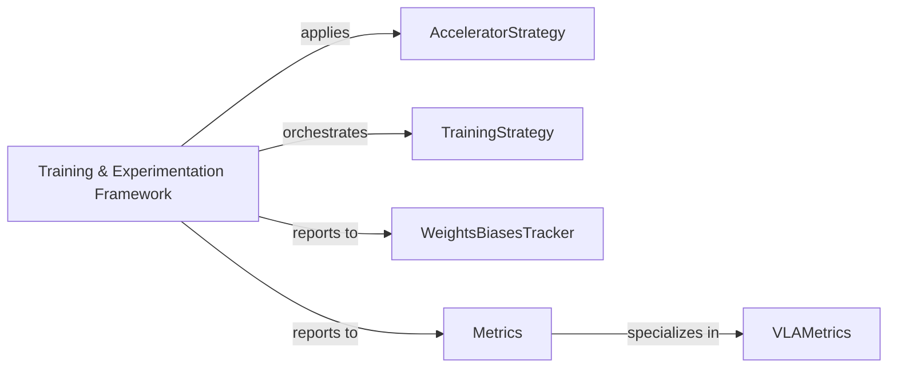

## Details

This component is fundamental to a research-oriented machine learning framework because it directly addresses the critical needs of reproducibility, efficiency, and systematic experimentation. By centralizing acceleration, optimization, and metric tracking, it provides researchers with a robust and consistent environment to develop, train, and compare VLA models effectively. Its modular design, evident through distinct strategy and metrics classes, promotes extensibility and allows for easy integration of new research ideas and tracking tools.

### Training & Experimentation Framework [[Expand]](./Training_Experimentation_Framework.md)
This core component orchestrates the entire machine learning model training lifecycle within the `vlaos` project. It provides robust mechanisms for defining and applying various acceleration strategies (e.g., distributed training, mixed precision), managing optimization processes, and offering comprehensive metric tracking capabilities. Its design emphasizes reproducibility and efficient experimental analysis, crucial for a research-oriented machine learning framework.

**Related Classes/Methods**:

- `AcceleratorStrategy` (1:1)
- `TrainingStrategy` (1:1)
- `WeightsBiasesTracker` (1:1)
- <a href="https://github.com/HeegerGao/VLA-OS/blob/main/vlaos/training/metrics.py#L1-L1" target="_blank" rel="noopener noreferrer">`Metrics` (1:1)</a>
- `VLAMetrics` (1:1)

### AcceleratorStrategy
Defines interfaces and implementations for various training acceleration techniques, such as distributed training, mixed precision, and gradient accumulation.

**Related Classes/Methods**:

- `AcceleratorStrategy` (1:1)

### TrainingStrategy
Serves as the foundational abstract class or interface for different training paradigms (e.g., supervised learning, reinforcement learning, self-supervised learning), allowing for extensible training workflows.

**Related Classes/Methods**:

- `TrainingStrategy` (1:1)

### WeightsBiasesTracker
Integrates with the Weights & Biases platform for advanced experiment tracking, visualization, and logging of training runs, models, and datasets.

**Related Classes/Methods**:

- `WeightsBiasesTracker` (1:1)

### Metrics
Provides a general-purpose utility for collecting, aggregating, and managing various training and evaluation metrics.

**Related Classes/Methods**:

- <a href="https://github.com/HeegerGao/VLA-OS/blob/main/vlaos/training/metrics.py#L1-L1" target="_blank" rel="noopener noreferrer">`Metrics` (1:1)</a>

### VLAMetrics
Specializes in metrics relevant to Vision-Language-Action (VLA) models, ensuring domain-specific performance tracking.

**Related Classes/Methods**:

- `VLAMetrics` (1:1)

### [FAQ](https://github.com/CodeBoarding/GeneratedOnBoardings/tree/main?tab=readme-ov-file#faq)