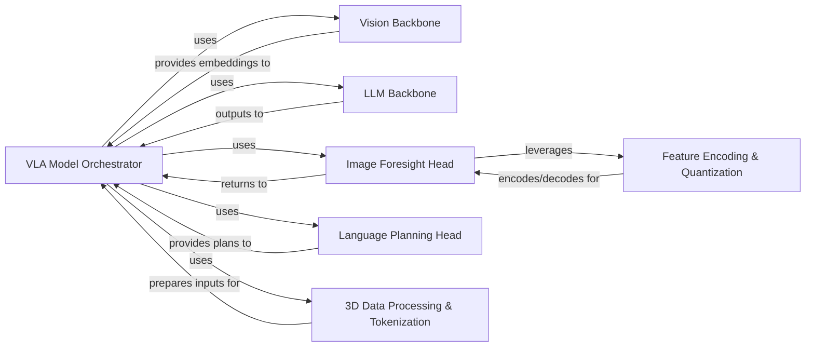

## Details

The `VLA Model Core` subsystem is the heart of the project, encompassing the foundational neural network architectures, primary Vision-Language-Action models with specialized heads, and reusable low-level neural network components. It is designed to be modular and extensible, facilitating rapid experimentation with different VLA model configurations.

### VLA Model Orchestrator
This component is responsible for integrating and orchestrating the flow between the vision, language, and action components to form complete VLA models. It manages the overall forward pass and interaction logic for various VLA architectures, such as `ActionOnlyVLA` and `HierarchicalVLA`.

**Related Classes/Methods**:

- <a href="https://github.com/HeegerGao/VLA-OS/blob/main/vlaos/models/vla/action_only.py#L14-L146" target="_blank" rel="noopener noreferrer">`vlaos.models.vla.action_only.ActionOnlyVLA` (14:146)</a>
- <a href="https://github.com/HeegerGao/VLA-OS/blob/main/vlaos/models/vla/hierarchical_vla.py#L24-L347" target="_blank" rel="noopener noreferrer">`vlaos.models.vla.hierarchical_vla.HierarchicalVLA` (24:347)</a>

### Vision Backbone
Extracts high-level features from raw image inputs using various vision models, such as `TimmViTBackbone`. It serves as the primary visual perception module for the VLA models.

**Related Classes/Methods**:

- <a href="https://github.com/HeegerGao/VLA-OS/blob/main/vlaos/models/vision/base_vision.py#L1-L1" target="_blank" rel="noopener noreferrer">`vlaos.models.vision.base_vision.TimmViTBackbone` (1:1)</a>

### LLM Backbone
Processes and generates textual information, providing essential language understanding and generation capabilities. It acts as the linguistic processing module, exemplified by `HFCausalLLMBackbone`.

**Related Classes/Methods**:

- <a href="https://github.com/HeegerGao/VLA-OS/blob/main/vlaos/models/llm/base_llm.py#L1-L1" target="_blank" rel="noopener noreferrer">`vlaos.models.llm.base_llm.HFCausalLLMBackbone` (1:1)</a>

### Image Foresight Head
This specialized head predicts future visual states or generates images based on the current context and outputs from the VLA model. It handles image tokenization and generation processes, including components like `ImageGenerationHead` and `ImageForesightPlanningHead`.

**Related Classes/Methods**:

- <a href="https://github.com/HeegerGao/VLA-OS/blob/main/vlaos/models/vla/image_foresight_head.py#L66-L545" target="_blank" rel="noopener noreferrer">`vlaos.models.vla.image_foresight_head.ImageGenerationHead` (66:545)</a>
- <a href="https://github.com/HeegerGao/VLA-OS/blob/main/vlaos/models/vla/image_foresight_head.py#L547-L721" target="_blank" rel="noopener noreferrer">`vlaos.models.vla.image_foresight_head.ImageForesightPlanningHead` (547:721)</a>

### Language Planning Head
Generates high-level language plans or instructions based on the VLA model's understanding of the task and environment. This component translates internal model states into human-readable or actionable language.

**Related Classes/Methods**:

- <a href="https://github.com/HeegerGao/VLA-OS/blob/main/vlaos/models/vla/language_planning_head.py#L164-L390" target="_blank" rel="noopener noreferrer">`vlaos.models.vla.language_planning_head.LanguagePlanningHead` (164:390)</a>

### Feature Encoding & Quantization
Provides core functionalities for efficient data representation, compression, and reconstruction. This includes autoencoders (`AutoEncoder`), quantization mechanisms (`BSQ`, `MultiScaleBSQ`), and attention blocks (`AttnBlock`), which are crucial for handling large visual data efficiently as reusable building blocks.

**Related Classes/Methods**:

- <a href="https://github.com/HeegerGao/VLA-OS/blob/main/utils/infinity_utils.py#L644-L967" target="_blank" rel="noopener noreferrer">`utils.infinity_utils.BSQ` (644:967)</a>
- <a href="https://github.com/HeegerGao/VLA-OS/blob/main/utils/infinity_utils.py#L969-L1183" target="_blank" rel="noopener noreferrer">`utils.infinity_utils.MultiScaleBSQ` (969:1183)</a>
- <a href="https://github.com/HeegerGao/VLA-OS/blob/main/utils/infinity_utils.py#L1301-L1330" target="_blank" rel="noopener noreferrer">`utils.infinity_utils.AttnBlock` (1301:1330)</a>
- <a href="https://github.com/HeegerGao/VLA-OS/blob/main/utils/infinity_utils.py#L1425-L1526" target="_blank" rel="noopener noreferrer">`utils.infinity_utils.Encoder` (1425:1526)</a>
- <a href="https://github.com/HeegerGao/VLA-OS/blob/main/utils/infinity_utils.py#L1529-L1628" target="_blank" rel="noopener noreferrer">`utils.infinity_utils.Decoder` (1529:1628)</a>
- <a href="https://github.com/HeegerGao/VLA-OS/blob/main/utils/infinity_utils.py#L1631-L1797" target="_blank" rel="noopener noreferrer">`utils.infinity_utils.AutoEncoder` (1631:1797)</a>

### 3D Data Processing & Tokenization
Processes and tokenizes 3D spatial data, such as robotic gripper states or 3D point clouds, for seamless integration into the VLA model. It includes components for rotary position encoding (`RotaryPositionEncoding3D`) and attention mechanisms (`MultiheadCustomAttention`) tailored for 3D data.

**Related Classes/Methods**:

- <a href="https://github.com/HeegerGao/VLA-OS/blob/main/utils/three_d_tokenizer.py#L59-L98" target="_blank" rel="noopener noreferrer">`utils.three_d_tokenizer.RotaryPositionEncoding3D` (59:98)</a>
- <a href="https://github.com/HeegerGao/VLA-OS/blob/main/utils/three_d_tokenizer.py#L159-L184" target="_blank" rel="noopener noreferrer">`utils.three_d_tokenizer.FeedforwardLayer` (159:184)</a>
- <a href="https://github.com/HeegerGao/VLA-OS/blob/main/utils/three_d_tokenizer.py#L217-L331" target="_blank" rel="noopener noreferrer">`utils.three_d_tokenizer.MultiheadCustomAttention` (217:331)</a>
- <a href="https://github.com/HeegerGao/VLA-OS/blob/main/utils/three_d_tokenizer.py#L650-L961" target="_blank" rel="noopener noreferrer">`utils.three_d_tokenizer.Encoder` (650:961)</a>

### [FAQ](https://github.com/CodeBoarding/GeneratedOnBoardings/tree/main?tab=readme-ov-file#faq)