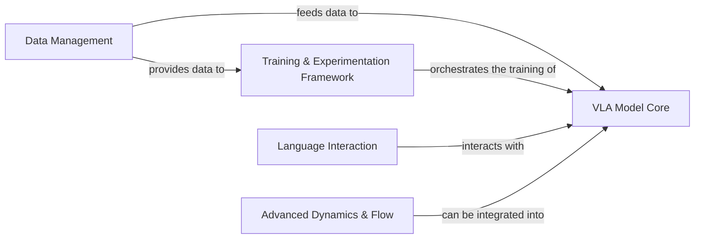

## Details

VLA-OS is a modular, research-oriented machine learning framework designed for Vision-Language-Action models, emphasizing configurability and rapid experimentation. The architecture is centered around the VLA Model Core, which integrates foundational vision and language backbones with specialized VLA architectures and low-level neural network utilities. Data is prepared and supplied by the Data Management component, which feeds into both the VLA Model Core for processing and the Training & Experimentation Framework for orchestrating the entire training lifecycle, including optimization and metric tracking. The Language Interaction component provides a dedicated interface for prompt-based communication with the VLA models, while the Advanced Dynamics & Flow component offers specialized mathematical utilities for continuous-time dynamics, which can be integrated into the core models. This design promotes clear separation of concerns, extensibility, and efficient iteration on VLA research ideas.

### Data Management [[Expand]](./Data_Management.md)
Responsible for loading, preprocessing, and batching diverse datasets, including specialized formats like RLDS, and handling modality splitting to prepare data for VLA models.

**Related Classes/Methods**:

- <a href="https://github.com/HeegerGao/VLA-OS/blob/main/vlaos/datasets/datasets.py#L1-L1" target="_blank" rel="noopener noreferrer">`vlaos.datasets.datasets.RLDSDataset` (1:1)</a>
- <a href="https://github.com/HeegerGao/VLA-OS/blob/main/utils/batching_utils.py#L1-L1" target="_blank" rel="noopener noreferrer">`utils.batching_utils.SplitModalitySampler` (1:1)</a>

### VLA Model Core [[Expand]](./VLA_Model_Core.md)
Encompasses the foundational neural network architectures (vision, language backbones), the primary Vision-Language-Action models with specialized heads (action prediction, image generation, language planning), and reusable low-level neural network components (attention, encoders, 3D utilities) that serve as building blocks for all models.

**Related Classes/Methods**:

- <a href="https://github.com/HeegerGao/VLA-OS/blob/main/vlaos/models/llm/base_llm.py#L1-L1" target="_blank" rel="noopener noreferrer">`vlaos.models.llm.base_llm.HFCausalLLMBackbone` (1:1)</a>
- <a href="https://github.com/HeegerGao/VLA-OS/blob/main/vlaos/models/vision/base_vision.py#L1-L1" target="_blank" rel="noopener noreferrer">`vlaos.models.vision.base_vision.TimmViTBackbone` (1:1)</a>
- <a href="https://github.com/HeegerGao/VLA-OS/blob/main/vlaos/models/vla/action_only.py#L14-L146" target="_blank" rel="noopener noreferrer">`vlaos.models.vla.action_only.ActionOnlyVLA` (14:146)</a>
- <a href="https://github.com/HeegerGao/VLA-OS/blob/main/vlaos/models/vla/hierarchical_vla.py#L24-L347" target="_blank" rel="noopener noreferrer">`vlaos.models.vla.hierarchical_vla.HierarchicalVLA` (24:347)</a>
- <a href="https://github.com/HeegerGao/VLA-OS/blob/main/vlaos/models/vla/image_foresight_head.py#L66-L545" target="_blank" rel="noopener noreferrer">`vlaos.models.vla.image_foresight_head.ImageGenerationHead` (66:545)</a>
- <a href="https://github.com/HeegerGao/VLA-OS/blob/main/vlaos/models/vla/image_foresight_head.py#L547-L721" target="_blank" rel="noopener noreferrer">`vlaos.models.vla.image_foresight_head.ImageForesightPlanningHead` (547:721)</a>
- <a href="https://github.com/HeegerGao/VLA-OS/blob/main/vlaos/models/vla/language_planning_head.py#L164-L390" target="_blank" rel="noopener noreferrer">`vlaos.models.vla.language_planning_head.LanguagePlanningHead` (164:390)</a>
- <a href="https://github.com/HeegerGao/VLA-OS/blob/main/utils/infinity_utils.py#L644-L967" target="_blank" rel="noopener noreferrer">`utils.infinity_utils.BSQ` (644:967)</a>
- <a href="https://github.com/HeegerGao/VLA-OS/blob/main/utils/infinity_utils.py#L969-L1183" target="_blank" rel="noopener noreferrer">`utils.infinity_utils.MultiScaleBSQ` (969:1183)</a>
- <a href="https://github.com/HeegerGao/VLA-OS/blob/main/utils/infinity_utils.py#L1301-L1330" target="_blank" rel="noopener noreferrer">`utils.infinity_utils.AttnBlock` (1301:1330)</a>
- <a href="https://github.com/HeegerGao/VLA-OS/blob/main/utils/infinity_utils.py#L1425-L1526" target="_blank" rel="noopener noreferrer">`utils.infinity_utils.Encoder` (1425:1526)</a>
- <a href="https://github.com/HeegerGao/VLA-OS/blob/main/utils/infinity_utils.py#L1529-L1628" target="_blank" rel="noopener noreferrer">`utils.infinity_utils.Decoder` (1529:1628)</a>
- <a href="https://github.com/HeegerGao/VLA-OS/blob/main/utils/infinity_utils.py#L1631-L1797" target="_blank" rel="noopener noreferrer">`utils.infinity_utils.AutoEncoder` (1631:1797)</a>
- <a href="https://github.com/HeegerGao/VLA-OS/blob/main/utils/three_d_tokenizer.py#L59-L98" target="_blank" rel="noopener noreferrer">`utils.three_d_tokenizer.RotaryPositionEncoding3D` (59:98)</a>
- <a href="https://github.com/HeegerGao/VLA-OS/blob/main/utils/three_d_tokenizer.py#L159-L184" target="_blank" rel="noopener noreferrer">`utils.three_d_tokenizer.FeedforwardLayer` (159:184)</a>
- <a href="https://github.com/HeegerGao/VLA-OS/blob/main/utils/three_d_tokenizer.py#L217-L331" target="_blank" rel="noopener noreferrer">`utils.three_d_tokenizer.MultiheadCustomAttention` (217:331)</a>
- <a href="https://github.com/HeegerGao/VLA-OS/blob/main/utils/three_d_tokenizer.py#L650-L961" target="_blank" rel="noopener noreferrer">`utils.three_d_tokenizer.Encoder` (650:961)</a>
- <a href="https://github.com/HeegerGao/VLA-OS/blob/main/vlaos/models/vla/nn_utils.py#L193-L207" target="_blank" rel="noopener noreferrer">`vlaos.models.vla.nn_utils.GemmaRMSNorm` (193:207)</a>

### Training & Experimentation Framework [[Expand]](./Training_Experimentation_Framework.md)
Manages the entire training lifecycle, including defining acceleration strategies, optimization, and comprehensive metric tracking for experimental analysis, ensuring reproducibility and efficient research.

**Related Classes/Methods**:

- <a href="https://github.com/HeegerGao/VLA-OS/blob/main/vlaos/training/accelerator.py#L58-L374" target="_blank" rel="noopener noreferrer">`vlaos.training.accelerator.AcceleratorStrategy` (58:374)</a>
- <a href="https://github.com/HeegerGao/VLA-OS/blob/main/vlaos/training/base_strategy.py#L1-L1" target="_blank" rel="noopener noreferrer">`vlaos.training.base_strategy.TrainingStrategy` (1:1)</a>
- <a href="https://github.com/HeegerGao/VLA-OS/blob/main/vlaos/training/metrics.py#L1-L1" target="_blank" rel="noopener noreferrer">`vlaos.training.metrics.WeightsBiasesTracker` (1:1)</a>
- <a href="https://github.com/HeegerGao/VLA-OS/blob/main/vlaos/training/metrics.py#L1-L1" target="_blank" rel="noopener noreferrer">`vlaos.training.metrics.Metrics` (1:1)</a>
- <a href="https://github.com/HeegerGao/VLA-OS/blob/main/vlaos/training/metrics.py#L1-L1" target="_blank" rel="noopener noreferrer">`vlaos.training.metrics.VLAMetrics` (1:1)</a>

### Language Interaction
Provides capabilities for constructing and managing prompts, enabling effective interaction with language models and integrating linguistic instructions or queries into the VLA framework.

**Related Classes/Methods**:

- <a href="https://github.com/HeegerGao/VLA-OS/blob/main/vlaos/models/llm/prompting/base_prompter.py#L1-L1" target="_blank" rel="noopener noreferrer">`vlaos.models.llm.prompting.base_prompter.PurePromptBuilder` (1:1)</a>

### Advanced Dynamics & Flow [[Expand]](./Advanced_Dynamics_Flow.md)
Offers utilities and models for handling continuous-time dynamics, including ODE solvers and flow matching techniques, potentially operating on various mathematical manifolds, supporting advanced modeling paradigms.

**Related Classes/Methods**:

- <a href="https://github.com/HeegerGao/VLA-OS/blob/main/utils/flow_matching_utils.py#L62-L100" target="_blank" rel="noopener noreferrer">`utils.flow_matching_utils.ConvexScheduler` (62:100)</a>
- <a href="https://github.com/HeegerGao/VLA-OS/blob/main/utils/flow_matching/path/scheduler/scheduler.py#L62-L100" target="_blank" rel="noopener noreferrer">`utils.flow_matching.path.scheduler.scheduler.ConvexScheduler` (62:100)</a>
- <a href="https://github.com/HeegerGao/VLA-OS/blob/main/utils/flow_matching/utils/manifolds/sphere.py#L12-L44" target="_blank" rel="noopener noreferrer">`utils.flow_matching.utils.manifolds.sphere.Sphere` (12:44)</a>
- <a href="https://github.com/HeegerGao/VLA-OS/blob/main/vlaos/models/vla/ode_solver.py#L90-L111" target="_blank" rel="noopener noreferrer">`vlaos.models.vla.ode_solver.CFGScaledModel` (90:111)</a>

### [FAQ](https://github.com/CodeBoarding/GeneratedOnBoardings/tree/main?tab=readme-ov-file#faq)