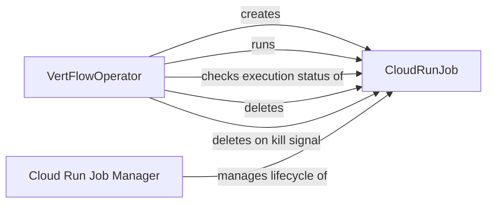

## Component Details

The VertFlow system orchestrates the execution of Cloud Run jobs. The VertFlowOperator defines the execution flow, creating, running, monitoring, and deleting CloudRunJob instances. CloudRunJob encapsulates the interaction with the Cloud Run service, abstracting the underlying API calls. The system ensures jobs are executed successfully and cleans up resources upon completion or termination.

### VertFlowOperator
The VertFlowOperator orchestrates the execution of Cloud Run jobs. It defines the execution flow, including creating a CloudRunJob, running it, checking for successful execution, and deleting it. It also handles the 'on_kill' signal, triggering job deletion.
- **Related Classes/Methods**: `VertFlow.src.operator.VertFlowOperator:execute`, `VertFlow.src.operator.VertFlowOperator:on_kill`

### CloudRunJob
The CloudRunJob component encapsulates the interaction with the Cloud Run service. It provides methods for creating, running, and deleting Cloud Run jobs, as well as checking for successful execution. It abstracts the underlying Cloud Run API calls.
- **Related Classes/Methods**: `VertFlow.src.cloud_run.CloudRunJob:create`, `VertFlow.src.cloud_run.CloudRunJob:run`, `VertFlow.src.cloud_run.CloudRunJob:executed_successfully`, `VertFlow.src.cloud_run.CloudRunJob:delete`

### Cloud Run Job Manager
The Cloud Run Job Manager is responsible for the lifecycle management of Cloud Run jobs. It handles the creation, execution, deletion, and status checking of these jobs, interacting directly with the Cloud Run service. This component abstracts away the complexities of managing individual Cloud Run instances.
- **Related Classes/Methods**: `VertFlow.src.cloud_run.CloudRunJob:delete`, `VertFlow.src.cloud_run.CloudRunJob:create`, `VertFlow.src.cloud_run.CloudRunJob:run`, `VertFlow.src.cloud_run.CloudRunJob:executed_successfully`
