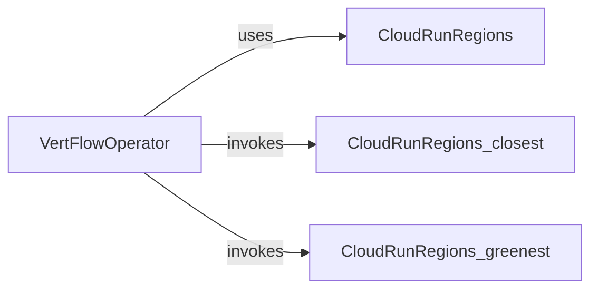

## Component Details

The Region Selector component is responsible for determining the optimal Cloud Run region for job execution within the VertFlow system. It provides functionalities to select regions based on proximity or environmental impact, allowing for efficient resource utilization and adherence to environmental considerations. The main flow involves the VertFlowOperator invoking the CloudRunRegions class to determine the appropriate region based on the specified criteria (closest or greenest).

### VertFlowOperator
The VertFlowOperator orchestrates the execution of the workflow. It determines the execution region by utilizing the CloudRunRegions component based on the specified selection criteria. It then executes the job in the selected region.
- **Related Classes/Methods**: `VertFlow.src.operator.VertFlowOperator:execute`

### CloudRunRegions
The CloudRunRegions class encapsulates the logic for determining the closest and greenest Cloud Run regions. It provides methods to retrieve the optimal region based on proximity or environmental impact, using a predefined list of available regions and their associated data.
- **Related Classes/Methods**: `VertFlow.src.data.CloudRunRegions:closest`, `VertFlow.src.data.CloudRunRegions:greenest`
