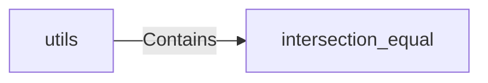

## Component Details

The Utility Functions component provides a set of general-purpose functions designed to support various operations throughout the VertFlow project. These utilities promote code reuse and simplify complex tasks by offering functionalities such as checking for equality between intersections of lists/sets, and other common operations. The central module is `utils`, which houses these functions, and they are utilized by other components within the system as needed.

### intersection_equal
This function determines whether the intersection of two input lists or sets is equal. It converts the inputs to sets and compares their intersection, returning True if the intersection is equal to the first set, and False otherwise. This is useful for verifying if one collection contains all the elements of another.
- **Related Classes/Methods**: `VertFlow.src.utils:intersection_equal`

### utils
This module serves as a container for various utility functions used across the VertFlow project. It includes functions like `intersection_equal` and potentially others for common tasks such as data manipulation, validation, or other supporting operations. The module aims to centralize these functionalities to avoid code duplication and improve maintainability.
- **Related Classes/Methods**: `VertFlow.src.utils`
