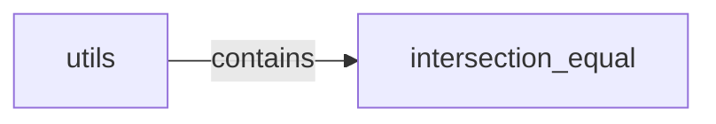

## Component Details

The UtilityFunctions component provides a set of general-purpose utility functions used throughout the VertFlow system. These functions offer common functionalities that are leveraged across different modules, promoting code reuse and simplifying development. The main flow involves other components calling these utility functions to perform common operations, making the codebase more maintainable and efficient.

### intersection_equal
This function checks if the intersection of two input lists/sets is equal. It converts the inputs to sets and compares their intersection. It returns True if the intersection is equal to the first set, and False otherwise.
- **Related Classes/Methods**: `VertFlow.src.utils`

### utils
This module contains a collection of utility functions, including `intersection_equal`. It serves as a central location for reusable code, promoting code reuse and simplifying development.
- **Related Classes/Methods**: `VertFlow.src.utils`
