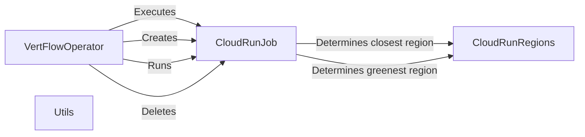

## Component Details

The Workflow Orchestrator manages the execution of VertFlow workflows by coordinating individual Cloud Run jobs. It leverages the Cloud Run Job Manager to handle job lifecycles and the Region Selector to optimize job placement. The orchestrator ensures reliable workflow execution by managing job termination and overall workflow progression.

### VertFlowOperator
Defines the interface for operators that perform specific tasks within VertFlow workflows. It includes methods for execution (`execute`) and handling kill signals (`on_kill`). It serves as the base class for concrete operator implementations.
- **Related Classes/Methods**: `VertFlow.src.operator.VertFlowOperator`

### CloudRunJob
Manages the lifecycle of a Cloud Run job, including creation, running, deletion, and checking its success status. It interacts with the Cloud Run API to perform these operations, encapsulating the details of Cloud Run job management.
- **Related Classes/Methods**: `VertFlow.src.cloud_run.CloudRunJob`

### CloudRunRegions
Provides geographical data and methods for selecting optimal Cloud Run regions based on proximity or environmental factors (e.g., carbon footprint). It helps in determining the best region to execute a Cloud Run job.
- **Related Classes/Methods**: `VertFlow.src.data.CloudRunRegions`

### Utils
Provides utility functions used throughout VertFlow, such as helper functions for interacting with the Cloud Run API or manipulating data. These utilities streamline common tasks and improve code reusability.
- **Related Classes/Methods**: `VertFlow.src.utils`
