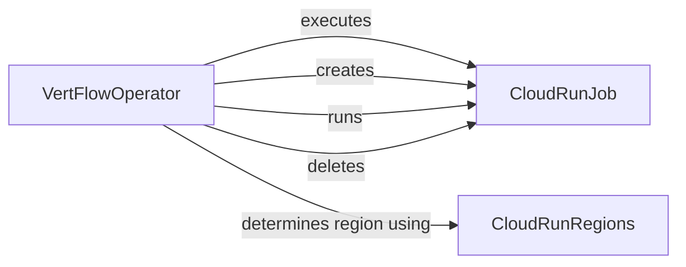

## Component Details

The VertFlow system orchestrates the execution of workflows by managing Cloud Run jobs and selecting appropriate regions. The central component, VertFlowOperator, defines the execution flow, utilizing CloudRunJob for job management and CloudRunRegions for region selection. The system supports creating, running, monitoring, and deleting Cloud Run jobs, ensuring efficient and reliable workflow execution.

### VertFlowOperator
The VertFlowOperator is the core component responsible for executing the workflow. It orchestrates the creation, execution, and monitoring of Cloud Run jobs. It determines the appropriate Cloud Run region using CloudRunRegions and interacts with CloudRunJob to manage the lifecycle of individual jobs.
- **Related Classes/Methods**: `VertFlow.src.operator.VertFlowOperator:execute`, `VertFlow.src.operator.VertFlowOperator:on_kill`

### CloudRunJob
The CloudRunJob component represents a Cloud Run job and provides methods for managing its lifecycle. It allows for creating, running, checking the execution status, and deleting Cloud Run jobs. It encapsulates the interaction with the Cloud Run service.
- **Related Classes/Methods**: `VertFlow.src.cloud_run.CloudRunJob:create`, `VertFlow.src.cloud_run.CloudRunJob:run`, `VertFlow.src.cloud_run.CloudRunJob:executed_successfully`, `VertFlow.src.cloud_run.CloudRunJob:delete`

### CloudRunRegions
The CloudRunRegions component provides methods for determining the appropriate Cloud Run region based on proximity or environmental considerations. It helps optimize job execution by selecting the most suitable region.
- **Related Classes/Methods**: `VertFlow.src.data.CloudRunRegions:closest`, `VertFlow.src.data.CloudRunRegions:greenest`
