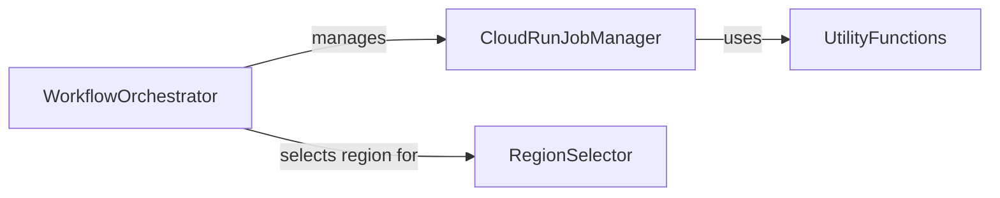

## Component Details

VertFlow orchestrates cloud workflows by managing Cloud Run jobs across different regions. It allows users to define and execute workflows that leverage Cloud Run for scalable and efficient task execution. The system incorporates region selection based on proximity or environmental impact, ensuring optimal resource utilization and cost-effectiveness. VertFlow provides a framework for automating complex cloud-based processes.

### CloudRunJobManager
The CloudRunJobManager component is responsible for managing the lifecycle of Cloud Run jobs. It handles the creation, execution, deletion, and status checking of these jobs, interacting directly with the Google Cloud Run service. This component abstracts the complexities of interacting with Cloud Run, providing a simplified interface for other components to manage jobs.
- **Related Classes/Methods**: `VertFlow.src.cloud_run.CloudRunJob:delete`, `VertFlow.src.cloud_run.CloudRunJob:create`, `VertFlow.src.cloud_run.CloudRunJob:run`, `VertFlow.src.cloud_run.CloudRunJob:executed_successfully`

### RegionSelector
The RegionSelector component selects the most suitable Cloud Run region for job execution based on predefined criteria. It offers methods for identifying the closest or greenest available regions, enabling optimization for latency, cost, or environmental impact. This component ensures that jobs are executed in the most appropriate location based on the specified requirements.
- **Related Classes/Methods**: `VertFlow.src.data.CloudRunRegions:closest`, `VertFlow.src.data.CloudRunRegions:greenest`

### WorkflowOrchestrator
The WorkflowOrchestrator component orchestrates the execution of workflows by managing Cloud Run jobs and selecting regions. It defines the main execution flow, calling upon the CloudRunJobManager and RegionSelector to perform their respective tasks. This component is responsible for the overall coordination of the workflow, ensuring that jobs are executed in the correct order and with the appropriate resources.
- **Related Classes/Methods**: `VertFlow.src.operator.VertFlowOperator:execute`, `VertFlow.src.operator.VertFlowOperator:on_kill`

### UtilityFunctions
The UtilityFunctions component provides a collection of general-purpose utility functions used by other components within the VertFlow system. These functions offer common functionalities that are leveraged across different modules, promoting code reuse and simplifying development. This component encapsulates common operations, making the codebase more maintainable and efficient.
- **Related Classes/Methods**: `VertFlow.src.utils:intersection_equal`