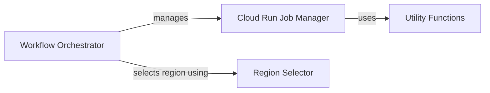

## Component Details

VertFlow orchestrates cloud workflows by managing Cloud Run jobs across different regions, optimizing for factors like proximity and environmental impact. The core flow involves the Workflow Orchestrator receiving a task, selecting an appropriate region using the Region Selector, and then delegating the job's lifecycle management to the Cloud Run Job Manager. Utility functions provide supporting capabilities throughout this process, ensuring efficient and reliable workflow execution.

### Cloud Run Job Manager
The Cloud Run Job Manager is responsible for the lifecycle management of Cloud Run jobs. It handles the creation, execution, deletion, and status checking of these jobs, interacting directly with the Cloud Run service. This component abstracts away the complexities of managing individual Cloud Run instances.
- **Related Classes/Methods**: `VertFlow.src.cloud_run.CloudRunJob:delete`, `VertFlow.src.cloud_run.CloudRunJob:create`, `VertFlow.src.cloud_run.CloudRunJob:run`, `VertFlow.src.cloud_run.CloudRunJob:executed_successfully`

### Region Selector
The Region Selector determines the optimal Cloud Run region for job execution based on predefined criteria. It offers methods to select regions based on proximity or environmental impact, allowing for efficient resource utilization and adherence to environmental considerations. This component ensures that jobs are executed in the most suitable location.
- **Related Classes/Methods**: `VertFlow.src.data.CloudRunRegions:closest`, `VertFlow.src.data.CloudRunRegions:greenest`

### Workflow Orchestrator
The Workflow Orchestrator is the central component responsible for executing the overall workflow. It utilizes the Cloud Run Job Manager to manage individual jobs and the Region Selector to determine the appropriate execution region. It also handles job termination when necessary, ensuring the smooth and reliable execution of the entire workflow.
- **Related Classes/Methods**: `VertFlow.src.operator.VertFlowOperator:execute`, `VertFlow.src.operator.VertFlowOperator:on_kill`

### Utility Functions
The Utility Functions component provides a collection of general-purpose functions used by other components within the system. These functions offer supporting capabilities that enhance the operation of other modules, promoting code reuse and simplifying complex tasks.
- **Related Classes/Methods**: `VertFlow.src.utils:intersection_equal`