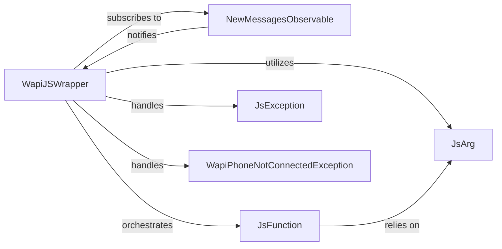

## Details

The `WhatsApp API Facade` subsystem is the core public interface of the `webwhatsapi` library, designed to abstract the complexities of WhatsApp Web interaction. It primarily resides within the `webwhatsapi/wapi_js_wrapper.py` file.

### WapiJSWrapper
The central Facade component, providing the primary public interface for WhatsApp Web interactions. It orchestrates session management, message sending, and data retrieval by abstracting underlying Selenium and JavaScript execution details.

**Related Classes/Methods**:

- <a href="https://github.com/mukulhase/WebWhatsapp-Wrapper/blob/master/webwhatsapi/wapi_js_wrapper.py#L22-L82" target="_blank" rel="noopener noreferrer">`WapiJSWrapper`:22-82</a>

### NewMessagesObservable
Implements the Observable pattern to manage the detection and notification of new incoming messages from WhatsApp Web. It allows other components to subscribe and react to message events.

**Related Classes/Methods**:

- <a href="https://github.com/mukulhase/WebWhatsapp-Wrapper/blob/master/webwhatsapi/wapi_js_wrapper.py#L158-L206" target="_blank" rel="noopener noreferrer">`NewMessagesObservable`:158-206</a>

### JsFunction
Acts as a proxy for specific JavaScript functions embedded within the WhatsApp Web client. It enables the Python layer to dynamically invoke these JavaScript functions, facilitating the execution of WhatsApp Web's internal logic.

**Related Classes/Methods**:

- <a href="https://github.com/mukulhase/WebWhatsapp-Wrapper/blob/master/webwhatsapi/wapi_js_wrapper.py#L113-L155" target="_blank" rel="noopener noreferrer">`JsFunction`:113-155</a>

### JsArg
Responsible for converting Python data types and structures into a format compatible with JavaScript functions. This component ensures seamless data exchange across the Python-JavaScript boundary.

**Related Classes/Methods**:

- <a href="https://github.com/mukulhase/WebWhatsapp-Wrapper/blob/master/webwhatsapi/wapi_js_wrapper.py#L85-L110" target="_blank" rel="noopener noreferrer">`JsArg`:85-110</a>

### JsException
A custom exception class representing general errors encountered during JavaScript execution within the WhatsApp Web context. It provides structured error reporting for issues originating from the JavaScript layer.

**Related Classes/Methods**:

- <a href="https://github.com/mukulhase/WebWhatsapp-Wrapper/blob/master/webwhatsapi/wapi_js_wrapper.py#L12-L14" target="_blank" rel="noopener noreferrer">`JsException`:12-14</a>

### WapiPhoneNotConnectedException
A specific custom exception indicating that the connected phone is not online or connected to WhatsApp Web. This allows for distinct error handling related to connectivity issues.

**Related Classes/Methods**:

- <a href="https://github.com/mukulhase/WebWhatsapp-Wrapper/blob/master/webwhatsapi/wapi_js_wrapper.py#L17-L19" target="_blank" rel="noopener noreferrer">`WapiPhoneNotConnectedException`:17-19</a>

### [FAQ](https://github.com/CodeBoarding/GeneratedOnBoardings/tree/main?tab=readme-ov-file#faq)