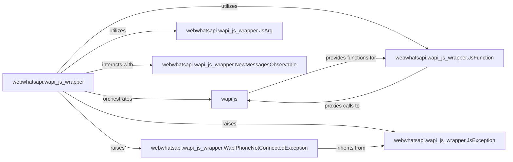

## Details

Updated analysis based on feedback, ensuring proper source code references for Python classes and retaining file path reference for `wapi.js` for documentation and diagram generation.

### webwhatsapi.wapi_js_wrapper
This Python module acts as the central facade for the entire subsystem. It provides a high-level, Pythonic API for interacting with WhatsApp Web, orchestrating the injection and execution of JavaScript code, and managing the communication flow between Python and the browser's JavaScript environment. It is the primary entry point for Python code to utilize the WhatsApp Web functionalities.

**Related Classes/Methods**:

- <a href="https://github.com/mukulhase/WebWhatsapp-Wrapper/blob/master/webwhatsapi/js/wapi.js" target="_blank" rel="noopener noreferrer">`wapi.js`</a>
- <a href="https://github.com/mukulhase/WebWhatsapp-Wrapper/blob/master/webwhatsapi/wapi_js_wrapper.py#L113-L155" target="_blank" rel="noopener noreferrer">`webwhatsapi.wapi_js_wrapper.JsFunction`:113-155</a>
- <a href="https://github.com/mukulhase/WebWhatsapp-Wrapper/blob/master/webwhatsapi/wapi_js_wrapper.py#L85-L110" target="_blank" rel="noopener noreferrer">`webwhatsapi.wapi_js_wrapper.JsArg`:85-110</a>
- <a href="https://github.com/mukulhase/WebWhatsapp-Wrapper/blob/master/webwhatsapi/wapi_js_wrapper.py#L158-L206" target="_blank" rel="noopener noreferrer">`webwhatsapi.wapi_js_wrapper.NewMessagesObservable`:158-206</a>
- <a href="https://github.com/mukulhase/WebWhatsapp-Wrapper/blob/master/webwhatsapi/wapi_js_wrapper.py#L12-L14" target="_blank" rel="noopener noreferrer">`webwhatsapi.wapi_js_wrapper.JsException`:12-14</a>
- <a href="https://github.com/mukulhase/WebWhatsapp-Wrapper/blob/master/webwhatsapi/wapi_js_wrapper.py#L17-L19" target="_blank" rel="noopener noreferrer">`webwhatsapi.wapi_js_wrapper.WapiPhoneNotConnectedException`:17-19</a>

### wapi.js
This core JavaScript file contains the low-level implementation details for directly manipulating the WhatsApp Web DOM and interacting with its internal APIs. It performs the actual browser-side operations, such as sending messages, retrieving chat data, and listening for events. It is the direct interface with the WhatsApp Web application.

**Related Classes/Methods**:

- <a href="https://github.com/mukulhase/WebWhatsapp-Wrapper/blob/master/webwhatsapi/js/wapi.js" target="_blank" rel="noopener noreferrer">`wapi.js`</a>

### webwhatsapi.wapi_js_wrapper.JsFunction
A Python class that serves as a proxy for specific JavaScript functions defined within `wapi.js`. It enables Python code to invoke these JavaScript functions as if they were native Python methods, abstracting the complexities of JavaScript execution and argument passing.

**Related Classes/Methods**:

- <a href="https://github.com/mukulhase/WebWhatsapp-Wrapper/blob/master/webwhatsapi/wapi_js_wrapper.py#L113-L155" target="_blank" rel="noopener noreferrer">`webwhatsapi.wapi_js_wrapper.JsFunction`:113-155</a>
- <a href="https://github.com/mukulhase/WebWhatsapp-Wrapper/blob/master/webwhatsapi/js/wapi.js" target="_blank" rel="noopener noreferrer">`wapi.js`</a>

### webwhatsapi.wapi_js_wrapper.JsArg
A Python class responsible for serializing Python data types into a format compatible with JavaScript arguments. This ensures that data passed from the Python application to JavaScript functions is correctly formatted and interpreted by the browser's JavaScript engine.

**Related Classes/Methods**:

- <a href="https://github.com/mukulhase/WebWhatsapp-Wrapper/blob/master/webwhatsapi/wapi_js_wrapper.py#L85-L110" target="_blank" rel="noopener noreferrer">`webwhatsapi.wapi_js_wrapper.JsArg`:85-110</a>

### webwhatsapi.wapi_js_wrapper.NewMessagesObservable
A Python class designed to observe and relay new message events originating from the WhatsApp Web JavaScript environment back to the Python application. It acts as a bridge for asynchronous event notifications, allowing the Python application to react to incoming messages.

**Related Classes/Methods**:

- <a href="https://github.com/mukulhase/WebWhatsapp-Wrapper/blob/master/webwhatsapi/wapi_js_wrapper.py#L158-L206" target="_blank" rel="noopener noreferrer">`webwhatsapi.wapi_js_wrapper.NewMessagesObservable`:158-206</a>

### webwhatsapi.wapi_js_wrapper.JsException
The base exception class for errors that originate from the JavaScript execution environment within WhatsApp Web. It provides a common type for catching and handling client-side issues gracefully within the Python application.

**Related Classes/Methods**:

- <a href="https://github.com/mukulhase/WebWhatsapp-Wrapper/blob/master/webwhatsapi/wapi_js_wrapper.py#L12-L14" target="_blank" rel="noopener noreferrer">`webwhatsapi.wapi_js_wrapper.JsException`:12-14</a>

### webwhatsapi.wapi_js_wrapper.WapiPhoneNotConnectedException
A specific exception class indicating that the phone is not connected to WhatsApp Web. This provides granular error handling for a common connection status issue, allowing the Python application to respond appropriately.

**Related Classes/Methods**:

- <a href="https://github.com/mukulhase/WebWhatsapp-Wrapper/blob/master/webwhatsapi/wapi_js_wrapper.py#L17-L19" target="_blank" rel="noopener noreferrer">`webwhatsapi.wapi_js_wrapper.WapiPhoneNotConnectedException`:17-19</a>
- <a href="https://github.com/mukulhase/WebWhatsapp-Wrapper/blob/master/webwhatsapi/wapi_js_wrapper.py#L12-L14" target="_blank" rel="noopener noreferrer">`webwhatsapi.wapi_js_wrapper.JsException`:12-14</a>

### [FAQ](https://github.com/CodeBoarding/GeneratedOnBoardings/tree/main?tab=readme-ov-file#faq)