```mermaid
graph LR
    Client_Application_Layer["Client Application Layer"]
    WhatsApp_API_Facade["WhatsApp API Facade"]
    Browser_Driver_Session_Manager["Browser Driver & Session Manager"]
    WhatsApp_Web_JavaScript_Interface["WhatsApp Web JavaScript Interface"]
    WhatsApp_Data_Models["WhatsApp Data Models"]
    Client_Application_Layer -- "Sends Commands / Requests Data" --> WhatsApp_API_Facade
    WhatsApp_API_Facade -- "Delegates Browser Control / Session Management" --> Browser_Driver_Session_Manager
    WhatsApp_API_Facade -- "Delegates WhatsApp Web Interactions / Executes JS Commands" --> WhatsApp_Web_JavaScript_Interface
    WhatsApp_Web_JavaScript_Interface -- "Utilizes Browser Context / Executes JS via Driver" --> Browser_Driver_Session_Manager
    Browser_Driver_Session_Manager -- "Provides Browser Context / Receives JS Results" --> WhatsApp_Web_JavaScript_Interface
    WhatsApp_Web_JavaScript_Interface -- "Populates / Creates Data Objects" --> WhatsApp_Data_Models
    WhatsApp_API_Facade -- "Consumes / Returns Data Objects" --> WhatsApp_Data_Models
    click WhatsApp_API_Facade href "https://github.com/CodeBoarding/GeneratedOnBoardings/blob/main/WebWhatsapp-Wrapper/WhatsApp_API_Facade.md" "Details"
    click Browser_Driver_Session_Manager href "https://github.com/CodeBoarding/GeneratedOnBoardings/blob/main/WebWhatsapp-Wrapper/Browser_Driver_Session_Manager.md" "Details"
    click WhatsApp_Web_JavaScript_Interface href "https://github.com/CodeBoarding/GeneratedOnBoardings/blob/main/WebWhatsapp-Wrapper/WhatsApp_Web_JavaScript_Interface.md" "Details"
```

## Details

The `WebWhatsapp-Wrapper` library provides a Pythonic interface for automating interactions with WhatsApp Web. At its core, the **WhatsApp API Facade** acts as the central orchestrator, exposing high-level functionalities to the **Client Application Layer**. This facade delegates browser control and session management to the **Browser Driver & Session Manager**, which handles the underlying Selenium WebDriver instance. For direct interaction with WhatsApp Web's internal JavaScript, the **WhatsApp Web JavaScript Interface** bridges Python commands to the browser's context. Data exchanged during these interactions, such as contacts, chats, and messages, are structured and managed by the **WhatsApp Data Models**, ensuring a consistent representation of WhatsApp entities throughout the system. This architecture facilitates clear separation of concerns, enabling robust automation and data handling.

### Client Application Layer
Represents external applications or scripts that consume the `WebWhatsapp-Wrapper` library, initiating automation tasks and processing events.

**Related Classes/Methods**:

- <a href="https://github.com/mukulhase/WebWhatsapp-Wrapper/blob/master/sample/flask/webapi.py" target="_blank" rel="noopener noreferrer">`webapi`</a>
- <a href="https://github.com/mukulhase/WebWhatsapp-Wrapper/blob/master/sample/new_messages_observer.py" target="_blank" rel="noopener noreferrer">`new_messages_observer`</a>

### WhatsApp API Facade [[Expand]](./WhatsApp_API_Facade.md)
The primary public interface of the library, exposing high-level methods for WhatsApp Web interaction and orchestrating operations.

**Related Classes/Methods**:

- <a href="https://github.com/mukulhase/WebWhatsapp-Wrapper/blob/master/webwhatsapi/wapi_js_wrapper.py#L22-L82" target="_blank" rel="noopener noreferrer">`WapiJSWrapper`:22-82</a>

### Browser Driver & Session Manager [[Expand]](./Browser_Driver_Session_Manager.md)
Manages the Selenium WebDriver instance, handling the browser's lifecycle and maintaining the active browser session state.

**Related Classes/Methods**:

- <a href="https://github.com/mukulhase/WebWhatsapp-Wrapper/blob/master/webwhatsapi/async_driver.py" target="_blank" rel="noopener noreferrer">`async_driver`</a>

### WhatsApp Web JavaScript Interface [[Expand]](./WhatsApp_Web_JavaScript_Interface.md)
Acts as a bridge between Python and WhatsApp Web's JavaScript environment, injecting and executing custom JavaScript for interactions.

**Related Classes/Methods**:

- <a href="https://github.com/mukulhase/WebWhatsapp-Wrapper/blob/master/webwhatsapi/wapi_js_wrapper.py" target="_blank" rel="noopener noreferrer">`wapi_js_wrapper`</a>
- <a href="https://github.com/mukulhase/WebWhatsapp-Wrapper/blob/master/webwhatsapi/js/wapi.js" target="_blank" rel="noopener noreferrer">`wapi`</a>

### WhatsApp Data Models
Defines Python classes for WhatsApp entities (Contact, Chat, Message), encapsulating and structuring data retrieved from WhatsApp Web.

**Related Classes/Methods**:

- <a href="https://github.com/mukulhase/WebWhatsapp-Wrapper/blob/master/sample/message_with_thumb.py" target="_blank" rel="noopener noreferrer">`chat`</a>
- <a href="https://github.com/mukulhase/WebWhatsapp-Wrapper/blob/master/sample/async_echo.py" target="_blank" rel="noopener noreferrer">`contact`</a>
- <a href="https://github.com/mukulhase/WebWhatsapp-Wrapper/blob/master/sample/async_echo.py" target="_blank" rel="noopener noreferrer">`message`</a>
- <a href="https://github.com/mukulhase/WebWhatsapp-Wrapper/blob/master/webwhatsapi/async_driver.py#L136-L137" target="_blank" rel="noopener noreferrer">`number_status`:136-137</a>
- <a href="https://github.com/mukulhase/WebWhatsapp-Wrapper/blob/master/webwhatsapi/objects/whatsapp_object.py" target="_blank" rel="noopener noreferrer">`whatsapp_object`</a>

### [FAQ](https://github.com/CodeBoarding/GeneratedOnBoardings/tree/main?tab=readme-ov-file#faq)