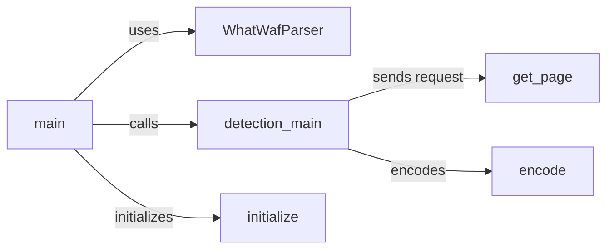

## Component Details

The WhatWaf application entry point orchestrates the WAF detection process. It starts by parsing command-line arguments using `WhatWafParser` to configure the application. The `main` function then initializes the database connection and calls `detection_main` to perform the core WAF detection logic. `detection_main` sends HTTP requests with various payloads, analyzes the responses, and identifies the presence of a WAF. Helper functions like `get_page`, `encode`, and database interaction functions are used to support the detection process.

### main
The main function serves as the application's entry point. It handles argument parsing, database initialization, and orchestrates the WAF detection process by calling `detection_main`.
- **Related Classes/Methods**: `WhatWaf.trigger.main:main` (61:564)

### WhatWafParser
The `WhatWafParser` class is responsible for parsing command-line arguments, defining available options, and configuring the application's behavior based on user input.
- **Related Classes/Methods**: `WhatWaf.trigger.main:WhatWafParser` (full file reference)

### detection_main
The `detection_main` function is the core of the WAF detection process. It sends HTTP requests with various payloads, analyzes the responses, and identifies the presence of a WAF.
- **Related Classes/Methods**: `WhatWaf.trigger.main:detection_main` (full file reference)

### get_page
The `get_page` function sends an HTTP request to a specified URL and returns the response, handling proxy settings, user agent, and request timeouts.
- **Related Classes/Methods**: `WhatWaf.trigger.main:get_page` (full file reference)

### encode
The `encode` function encodes a given payload using a specified encoding technique or tamper script, used to bypass WAF filters.
- **Related Classes/Methods**: `WhatWaf.trigger.main:encode` (full file reference)

### initialize
The `initialize` function initializes the database connection, creating necessary tables if they don't exist.
- **Related Classes/Methods**: `WhatWaf.trigger.main:initialize` (full file reference)