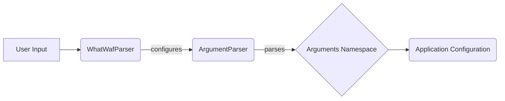

## Argument Parsing Component Overview

This component is responsible for parsing command-line arguments provided by the user and configuring the application's behavior accordingly. It uses the `argparse` module to define and handle the arguments.

**Component Descriptions:**

*   **User Input:** Represents the command-line arguments provided by the user when running the `whatwaf` script.
    *   Interaction: The user provides input to the `WhatWafParser`.
*   **WhatWafParser:** This component extends `ArgumentParser` to define and parse command-line arguments specific to WhatWaf. It initializes the argument parser and defines all available options.
    *   Interaction: It receives user input, configures the `ArgumentParser`, and passes the parsed arguments to the application configuration.
    *   Relevant source files: `lib.cmd.WhatWafParser`
*   **ArgumentParser:** The standard `argparse.ArgumentParser` class is used to define and parse command-line arguments. `WhatWafParser` configures this parser with the specific arguments for the application.
    *   Interaction: Configured by `WhatWafParser` and parses the command-line arguments into a namespace.
*   **Arguments Namespace:** A namespace object that holds the parsed arguments and their values. This namespace is created by `ArgumentParser`.
    *   Interaction: Provides the parsed arguments to the application configuration.
*   **Application Configuration:** This represents the application's configuration, which is set based on the parsed arguments. The application uses these configurations to control its behavior.
    *   Interaction: Receives the parsed arguments from the `Arguments Namespace` and configures the application.
