```mermaid
graph LR
    Auto_Update_Scheduler["Auto Update Scheduler"]
    Version_Checker["Version Checker"]
    Update_Downloader["Update Downloader"]
    Update_Installer["Update Installer"]
    Settings_Manager["Settings Manager"]
    Auto_Update_Scheduler -- "schedules and initiates" --> Version_Checker
    Version_Checker -- "determines need for" --> Update_Downloader
    Update_Downloader -- "prepares for" --> Update_Installer
    Update_Installer -- "applies" --> WhatWaf
    Settings_Manager -- "configures" --> Auto_Update_Scheduler
```

## Component Details

The Auto Updater component automates the process of keeping WhatWaf up-to-date with the latest fingerprints and detection rules. It checks for new versions at scheduled intervals, downloads updates, and installs them, ensuring that WhatWaf remains effective against evolving WAF technologies. The process is configured through settings that define the update frequency and source.

### Auto Update Scheduler
This component is responsible for scheduling and initiating the auto-update process. It reads the auto-update settings, determines the appropriate update interval, and triggers the version check based on the configured schedule.
- **Source Reference**: `WhatWaf.lib.settings:auto_update`
  - *File*: `WhatWaf/lib/settings.py`

### Version Checker
The Version Checker component compares the current version of WhatWaf with the latest available version from a remote source. It fetches the latest version information and determines if an update is needed.
- **Related Classes/Methods**: _None_

### Update Downloader
This component handles the downloading of the new version of WhatWaf from the remote source. It retrieves the update package and prepares it for installation.
- **Related Classes/Methods**: _None_

### Update Installer
The Update Installer component installs the downloaded update package, replacing the older version of WhatWaf with the new one. It ensures that the update is applied correctly and that WhatWaf is ready to use.
- **Related Classes/Methods**: _None_

### Settings Manager
This component manages the configuration settings related to auto-updates, such as the update interval, the remote source URL, and whether auto-updates are enabled or disabled. It provides the necessary parameters for the Auto Update Scheduler.
- **Source Reference**: `WhatWaf.lib.settings`
  - *File*: `WhatWaf/lib/settings.py`