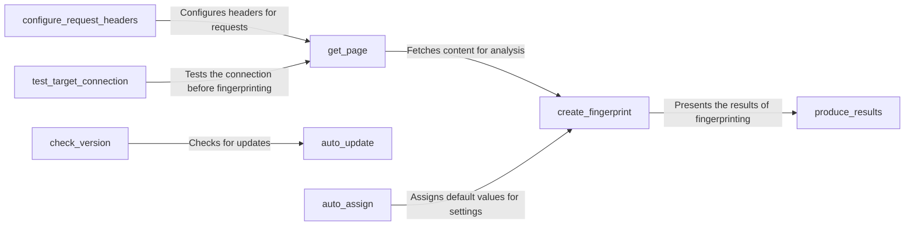

## Component Details

The Configuration Manager in WhatWaf is responsible for initializing and managing the application's settings and configurations. It handles tasks such as fetching web page content, configuring request headers, creating application fingerprints, testing target connections, and managing updates. This component ensures that the application is properly set up before the detection process begins, providing a centralized point for managing the application's configuration and ensuring consistent behavior.

### get_page
Retrieves the content of a web page. This function is used to fetch the HTML or other content from the target web application for analysis. It uses requests library to get the content from the target URL.
- **Related Classes/Methods**: `WhatWaf.lib.settings:get_page`

### configure_request_headers
Configures the headers for HTTP requests. This function sets up the user-agent, cookies, and other headers to mimic a real user or specific browser. It allows customization of the request headers to avoid detection or to simulate different user environments.
- **Related Classes/Methods**: `WhatWaf.lib.settings:configure_request_headers`

### create_fingerprint
Generates a fingerprint of the web application. This function analyzes the application's responses and creates a unique identifier. It is the core of the module, identifying the technology stack of the target web application.
- **Related Classes/Methods**: `WhatWaf.lib.settings:create_fingerprint`

### test_target_connection
Tests the connection to the target web application. This function verifies that the application is reachable before starting the fingerprinting process. It ensures that the target is accessible and responsive before proceeding with further analysis.
- **Related Classes/Methods**: `WhatWaf.lib.settings:test_target_connection`

### auto_update
Automatically updates the WhatWaf application. This function keeps the application up-to-date with the latest fingerprints and features. It ensures that the application has the most recent data for accurate detection.
- **Related Classes/Methods**: `WhatWaf.lib.settings:auto_update`

### produce_results
Formats and outputs the results of the fingerprinting or testing process. This function takes the raw data and presents it in a user-friendly format. It provides a clear and concise summary of the findings.
- **Related Classes/Methods**: `WhatWaf.lib.settings:produce_results`

### check_version
Checks the version of the WhatWaf application. This function ensures that the application is up-to-date. It verifies the current version against the latest available version.
- **Related Classes/Methods**: `WhatWaf.lib.settings:check_version`

### auto_assign
Automatically assigns values to certain settings or parameters. This function sets default values or infers values based on the target environment. It simplifies the configuration process by automatically determining appropriate settings.
- **Related Classes/Methods**: `WhatWaf.lib.settings:auto_assign`