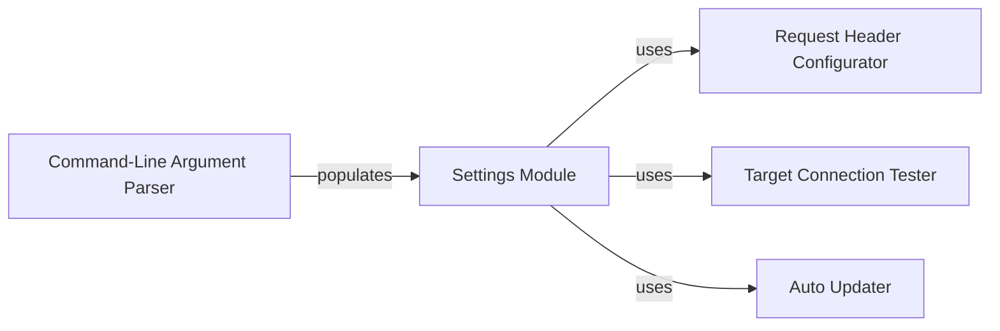

## Component Details

The Configuration Manager in WhatWaf is responsible for centralizing and managing all configuration aspects of the application. It handles loading settings from various sources, configuring request headers, managing target URLs, caching configurations, and facilitating automatic updates. This component ensures that all other components have access to the necessary configuration parameters, promoting consistency and simplifying management.

### Settings Module
The Settings Module serves as a central repository for application settings and configurations. It provides methods for configuring request headers, managing target URLs, handling caching, and facilitating automatic updates. It interacts with other components by providing them with the necessary configuration parameters.
- **Related Classes/Methods**: `WhatWaf.lib.settings` (1:880)

### Command-Line Argument Parser
The Command-Line Argument Parser is responsible for parsing command-line arguments provided by the user. It defines the available options and their corresponding actions, allowing users to customize the application's behavior. It interacts with the Settings Module to store the parsed arguments and make them accessible to other components.
- **Related Classes/Methods**: `WhatWaf.lib.cmd` (1:1000)

### Request Header Configurator
The Request Header Configurator configures the request headers that will be sent to the target. It handles setting user-agent strings, cookies, and other headers to simulate different clients or bypass certain security measures. It retrieves configuration from the Settings Module.
- **Related Classes/Methods**: `WhatWaf.lib.settings:configure_request_headers` (426:473)

### Target Connection Tester
The Target Connection Tester verifies the connection to the target URL before initiating the main process. It sends requests and checks the response status to ensure the target is reachable. It uses settings from the Settings Module to configure the connection.
- **Related Classes/Methods**: `WhatWaf.lib.settings:test_target_connection` (739:758)

### Auto Updater
The Auto Updater component manages the automatic updating of the WhatWaf application. It checks for new versions and downloads and installs them using git. It relies on the Settings Module for update-related configurations.
- **Related Classes/Methods**: `WhatWaf.lib.settings:auto_update` (973:993)