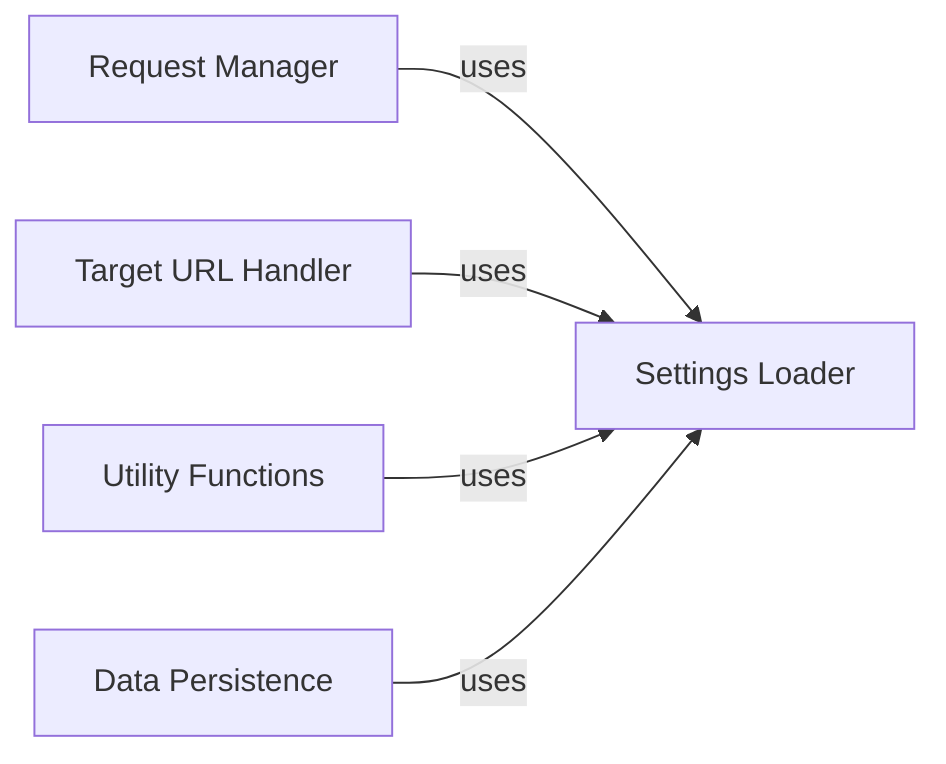

## Component Details

The Configuration Manager is responsible for handling the application's settings and configurations. It encompasses loading settings, managing request headers, handling target URLs, and managing updates. It serves as a centralized point for accessing and managing the application's configuration, ensuring that all components have access to the necessary parameters and settings to function correctly. It initializes the application state and provides utility functions for various tasks such as making HTTP requests, generating random strings, and writing data to files.

### Settings Loader
Loads and manages application settings from various sources, such as command-line arguments and configuration files. It initializes the application's state and provides access to configuration parameters.
- **Related Classes/Methods**: `WhatWaf.lib.cmd` (None:None)

### Request Manager
Configures and manages HTTP request headers, including proxy settings, Tor usage, and random User-Agent selection. It prepares the headers for making requests to the target URL.
- **Related Classes/Methods**: `WhatWaf.lib.settings:configure_request_headers` (426:473)

### Target URL Handler
Manages the target URL, including automatic protocol assignment (HTTP or HTTPS) if not specified. It ensures that the target URL is correctly formatted and accessible.
- **Related Classes/Methods**: `WhatWaf.lib.settings:auto_assign` (538:557)

### Utility Functions
Provides a collection of utility functions for various tasks, such as generating random strings, writing data to files, and checking for updates. These functions are used by other components to perform common operations.
- **Related Classes/Methods**: `WhatWaf.lib.settings:random_string` (500:513), `WhatWaf.lib.settings:write_to_file` (595:658), `WhatWaf.lib.settings:check_version` (696:719)

### Data Persistence
Handles writing data to files in various formats (JSON, YAML, CSV). It manages directory creation and file saving, providing a consistent way to store application data and results.
- **Related Classes/Methods**: `WhatWaf.lib.settings:write_to_file` (595:658)