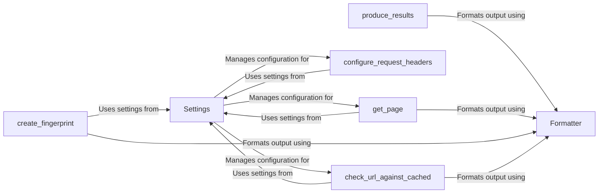

## Component Details

The Configuration Manager in WhatWaf is responsible for centralizing and managing all configuration settings required by the tool. It encompasses handling target URLs, configuring request headers, managing output formatting, and caching mechanisms. The core components work together to ensure that the tool operates with the correct settings, presents information effectively, and optimizes performance by caching results.

### Settings
The Settings class is the central configuration repository for WhatWaf. It stores and manages target URLs, request headers, and other global settings. It provides methods to access and modify these settings, ensuring that all components have access to the necessary configuration parameters.
- **Related Classes/Methods**: `WhatWaf.lib.settings.Settings`, `WhatWaf.lib.settings.get_page`, `WhatWaf.lib.settings.configure_request_headers`, `WhatWaf.lib.settings.check_url_against_cached`, `WhatWaf.lib.settings.produce_results`, `WhatWaf.lib.settings.create_fingerprint`, `WhatWaf.lib.settings.display_cached`
- **Source Files**: `WhatWaf/lib/settings.py`

### Formatter
The Formatter class handles the output formatting for the WhatWaf tool. It provides methods for logging messages of different levels (info, debug, warning, error, etc.) and ensures that the output is presented in a user-friendly and consistent manner.
- **Related Classes/Methods**: `WhatWaf.lib.formatter.Formatter`, `WhatWaf.lib.formatter.info`, `WhatWaf.lib.formatter.debug`, `WhatWaf.lib.formatter.warn`, `WhatWaf.lib.formatter.error`, `WhatWaf.lib.formatter.fatal`, `WhatWaf.lib.formatter.payload`, `WhatWaf.lib.formatter.success`, `WhatWaf.lib.formatter.discover`
- **Source Files**: `WhatWaf/lib/formatter.py`

### get_page
The `get_page` function is responsible for fetching the content of a web page. It makes HTTP requests to the target URL and retrieves the response. It uses the configured request headers from the Settings component.
- **Related Classes/Methods**: `WhatWaf.lib.settings.get_page`
- **Source Files**: `WhatWaf/lib/settings.py`

### configure_request_headers
The `configure_request_headers` function configures the HTTP request headers, allowing customization of the User-Agent, cookies, and other headers. It retrieves the settings from the Settings component.
- **Related Classes/Methods**: `WhatWaf.lib.settings.configure_request_headers`
- **Source Files**: `WhatWaf/lib/settings.py`

### check_url_against_cached
The `check_url_against_cached` function checks if the target URL has been previously scanned and if the results are cached. It improves performance by avoiding redundant scans. It uses the Settings component to store and retrieve cached results.
- **Related Classes/Methods**: `WhatWaf.lib.settings.check_url_against_cached`
- **Source Files**: `WhatWaf/lib/settings.py`

### produce_results
The `produce_results` function formats and displays the final results of the WAF detection process. It takes the identified WAF information and presents it in a user-friendly manner, utilizing the Formatter component for output.
- **Related Classes/Methods**: `WhatWaf.lib.settings.produce_results`
- **Source Files**: `WhatWaf/lib/settings.py`

### create_fingerprint
The `create_fingerprint` function generates a unique fingerprint of the target web server. This fingerprint is used to identify the WAF in use. It sends specific requests and analyzes the responses, using settings from the Settings component.
- **Related Classes/Methods**: `WhatWaf.lib.settings.create_fingerprint`
- **Source Files**: `WhatWaf/lib/settings.py`