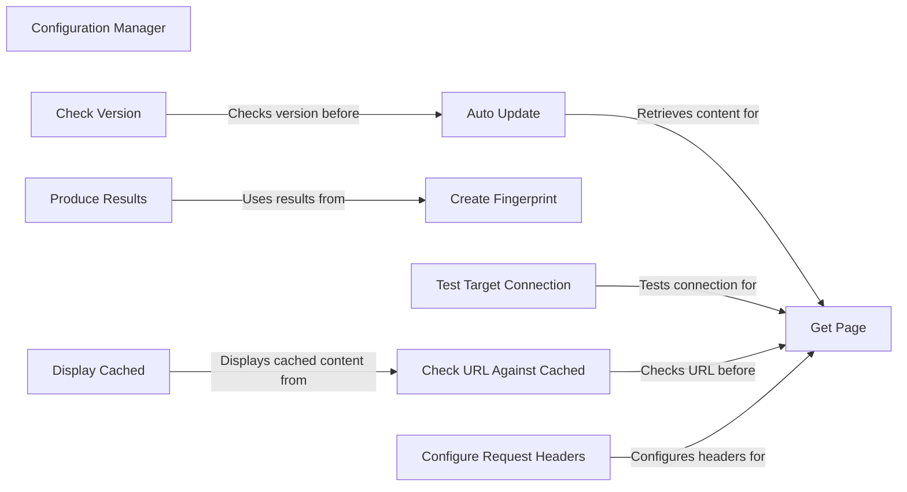

## Component Details

The WhatWaf application utilizes a configuration manager to handle settings, target URLs, request headers, timeouts, and auto-update features. The application begins by testing the target connection and checking for cached content. If the content is not cached, it retrieves the content of the web page, configuring request headers before sending the request. The application then creates a fingerprint of the target web server and produces results based on the fingerprint and scan data. The configuration manager also handles auto-updates by checking the current version against the latest available version. Random POST strings are generated for testing purposes.

### Configuration Manager
The Configuration Manager is responsible for handling the application's settings, target URLs, request headers, timeouts, and auto-update features. It ensures that the application is properly configured before running scans and manages updates to keep the tool current.
- **Related Classes/Methods**: `WhatWaf.lib.settings`

### Get Page
The Get Page component retrieves the content of a web page. This function is responsible for making HTTP requests and handling responses. It uses configured request headers and handles potential connection errors.
- **Related Classes/Methods**: `WhatWaf.lib.settings`

### Configure Request Headers
The Configure Request Headers component configures the headers of HTTP requests. This function sets user-agent, cookies, and other relevant headers to mimic a real browser and avoid detection.
- **Related Classes/Methods**: `WhatWaf.lib.settings`

### Produce Results
The Produce Results component formats and outputs the results of the web application firewall detection process. It takes the fingerprint and other scan data to generate a report.
- **Related Classes/Methods**: `WhatWaf.lib.settings`

### Create Fingerprint
The Create Fingerprint component creates a fingerprint of the target web server, which is used to identify the server and its configuration. This involves sending requests and analyzing the responses to determine the server type and version.
- **Related Classes/Methods**: `WhatWaf.lib.settings`

### Check Version
The Check Version component checks the current version of WhatWaf against the latest available version. It retrieves version information from a remote source and compares it with the local version.
- **Related Classes/Methods**: `WhatWaf.lib.settings`

### Auto Update
The Auto Update component automatically updates the WhatWaf application to the latest version. It checks for a new version and downloads/installs it if available.
- **Related Classes/Methods**: `WhatWaf.lib.settings`

### Test Target Connection
The Test Target Connection component tests the connection to the target web server to ensure it is reachable. This function sends a simple request to the target and checks for a successful response.
- **Related Classes/Methods**: `WhatWaf.lib.settings`

### Check URL Against Cached
The Check URL Against Cached component checks if the URL has been cached. This function determines if the content for a given URL is already stored in the cache.
- **Related Classes/Methods**: `WhatWaf.lib.settings`

### Display Cached
The Display Cached component displays the cached content of the URL. If the URL is cached, this function retrieves and displays the stored content.
- **Related Classes/Methods**: `WhatWaf.lib.settings`
