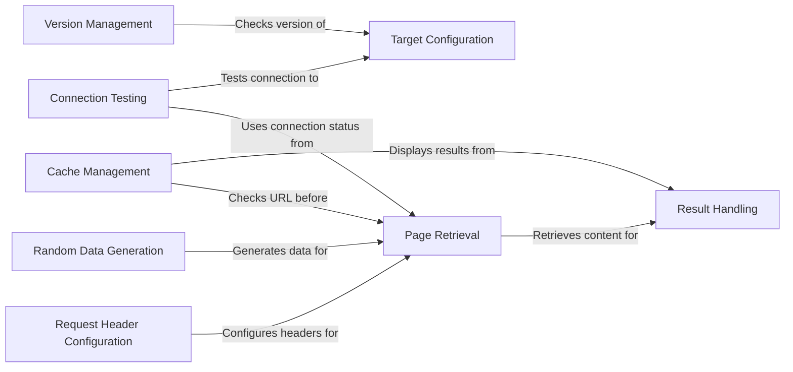

## Component Details

The Configuration Manager in WhatWaf is responsible for setting up and managing all aspects of configuration required for running web application firewall detection. It initializes settings, configures request headers, manages target URLs, handles version checking and auto-updating, and prepares the environment for scanning. The main flow involves setting up the environment, configuring the request, fetching the content, and producing the results.

### Target Configuration
This component handles the configuration of the target URL and request parameters. It sets up the initial target and ensures that the tool knows where to send requests.
- **Related Classes/Methods**: `WhatWaf.lib.settings`

### Request Header Configuration
This component configures the headers of HTTP requests, including user-agent, cookies, and other relevant headers. It ensures that the requests sent by WhatWaf appear legitimate and can bypass certain WAF configurations.
- **Related Classes/Methods**: `WhatWaf.lib.settings:configure_request_headers`

### Version Management
This component is responsible for checking the current version of WhatWaf and automatically updating it to the latest version. It ensures that the tool has the most up-to-date detection capabilities.
- **Related Classes/Methods**: `WhatWaf.lib.settings:check_version`, `WhatWaf.lib.settings:auto_update`

### Connection Testing
This component tests the connection to the target web server to ensure that the tool can reach the target before starting the scan. It verifies that the target is accessible and responsive.
- **Related Classes/Methods**: `WhatWaf.lib.settings:test_target_connection`

### Result Handling
This component formats and outputs the results of the web application firewall analysis. It handles different output formats and reporting, providing the user with clear and actionable information.
- **Related Classes/Methods**: `WhatWaf.lib.settings:produce_results`

### Page Retrieval
This component retrieves the content of a web page. It is responsible for making HTTP requests and handling responses, fetching the HTML content of the target URL.
- **Related Classes/Methods**: `WhatWaf.lib.settings:get_page`

### Cache Management
This component checks the URL against cached results to avoid redundant requests and displays cached results if available. It improves efficiency by reusing previous scan results.
- **Related Classes/Methods**: `WhatWaf.lib.settings:check_url_against_cached`, `WhatWaf.lib.settings:display_cached`

### Random Data Generation
This component generates a random string for use in POST requests. This is used for fuzzing or testing purposes, creating unpredictable data for WAF evasion.
- **Related Classes/Methods**: `WhatWaf.lib.settings:generate_random_post_string`