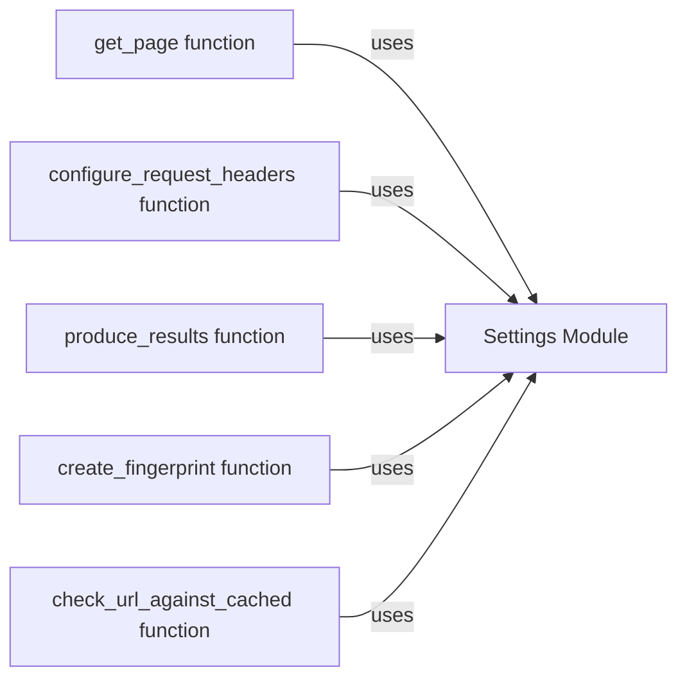

## Component Details

The Configuration and Settings Management component in WhatWaf is responsible for centralizing and managing all configuration aspects of the application. It handles tasks such as loading settings, configuring request headers, managing target URLs, caching responses, and handling version updates. This component ensures consistent behavior across the application by providing a single point of access for configuration data and offering methods for accessing and modifying these settings.

### Settings Module
This module serves as a central repository for application-wide settings and configurations. It encapsulates functions for configuring request headers, producing results, generating random strings, creating fingerprints, and managing cached data. It provides a consistent interface for accessing and modifying settings throughout the application.
- **Related Classes/Methods**: `WhatWaf.lib.settings` (1:993)

### get_page function
This function is responsible for retrieving the content of a web page. It handles making HTTP requests, handling redirects, and potentially caching the results. It's a core function for interacting with the target web application and retrieving data for analysis.
- **Related Classes/Methods**: `WhatWaf.lib.settings:get_page` (354:408)

### configure_request_headers function
This function configures the headers of HTTP requests. It sets user-agent strings, cookies, and other relevant headers to mimic legitimate user behavior or to bypass certain security measures. It is important for controlling how WhatWaf interacts with the target web application and influences the server's response.
- **Related Classes/Methods**: `WhatWaf.lib.settings:configure_request_headers` (426:473)

### produce_results function
This function is responsible for formatting and displaying the results of the web application firewall detection process. It takes the raw output from the detection algorithms and presents it in a user-friendly format, making the findings of WhatWaf accessible and understandable.
- **Related Classes/Methods**: `WhatWaf.lib.settings:produce_results` (476:497)

### create_fingerprint function
This function creates a fingerprint of the target web application. This fingerprint can be used to identify the web application and its underlying technologies. It is a key component for accurately detecting web application firewalls by providing a unique identifier for the target.
- **Related Classes/Methods**: `WhatWaf.lib.settings:create_fingerprint` (560:592)

### check_url_against_cached function
This function checks if a URL has been previously scanned and if the results are cached. This helps to improve performance by avoiding redundant scans and reducing the load on the target web application. It interacts with the caching mechanism of WhatWaf to retrieve previously stored results.
- **Related Classes/Methods**: `WhatWaf.lib.settings:check_url_against_cached` (850:873)