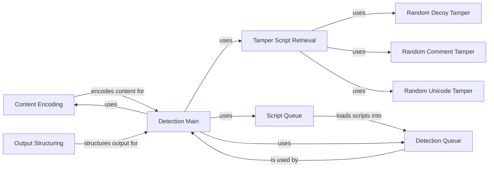

## Component Details

The Content Processing subsystem orchestrates the process of encoding requests, retrieving and applying tamper scripts to bypass WAFs, sending the modified requests, and structuring the responses into a dictionary format for analysis. It manages a queue of tamper scripts and detection requests, handling them in a threaded manner to improve efficiency. The core purpose is to automate the detection of Web Application Firewalls (WAFs) by systematically testing various evasion techniques and analyzing the server responses.

### Content Encoding
This component is responsible for encoding the request content using a specified encoding method. It ensures that the request is properly formatted before being sent to the server, handling different encoding schemes as needed.
- **Related Classes/Methods**: ``WhatWaf.content:encode` (24:32)`

### Tamper Script Retrieval
This component retrieves a list of tamper scripts that can be used to modify the request. These scripts are designed to bypass WAFs by altering the request in various ways, such as adding random parameters or comments.
- **Related Classes/Methods**: ``WhatWaf.content:get_working_tampers` (34:42)`

### Output Structuring
This component converts the raw response from the server into a structured dictionary format. This makes it easier to analyze the response and determine if a WAF is present, extracting relevant information for further processing.
- **Related Classes/Methods**: ``WhatWaf.content:dictify_output` (44:52)`

### Detection Main
This component is the main function that orchestrates the WAF detection process. It calls the encoding, tampering, and request sending functions, managing the overall flow of the detection process.
- **Related Classes/Methods**: ``WhatWaf.content:detection_main` (54:62)`

### Script Queue
This component loads and manages the tamper scripts used for WAF detection. It provides an interface for accessing and organizing the scripts, ensuring that the detection process has access to the necessary evasion techniques.
- **Related Classes/Methods**: ``WhatWaf.content.ScriptQueue:load_scripts` (64:72)`

### Detection Queue
This component manages the queue of detection requests and handles the sending of requests in a threaded manner. It retrieves responses and assists with threaded request handling, improving the efficiency of the detection process.
- **Related Classes/Methods**: ``WhatWaf.content.DetectionQueue:get_response` (74:82)`, ``WhatWaf.content.DetectionQueue:threader` (84:92)`, ``WhatWaf.content.DetectionQueue:threaded_get_response_helper` (94:102)`, ``WhatWaf.content.DetectionQueue:threaded_get_response` (104:112)`

### Random Decoy Tamper
This component is a tamper script that adds random decoy elements to the request to obfuscate the payload. It is one of the many tamper scripts used to bypass WAFs.
- **Related Classes/Methods**: ``WhatWaf.content.tampers.randomdecoys:tamper` (114:122)`

### Random Comment Tamper
This component is a tamper script that inserts random comments into the request to disrupt WAF parsing. It is another tamper script used to bypass WAFs.
- **Related Classes/Methods**: ``WhatWaf.content.tampers.randomcomments:tamper` (124:132)`

### Random Unicode Tamper
This component is a tamper script that introduces random Unicode characters into the request to exploit WAF vulnerabilities related to Unicode handling. It is a tamper script used to bypass WAFs.
- **Related Classes/Methods**: ``WhatWaf.content.tampers.randomunicode:tamper` (134:142)`