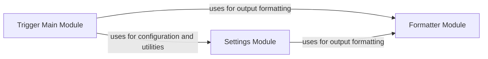

## Component Details

The core configuration and execution component forms the heart of the WhatWaf application. It initializes settings, orchestrates the WAF detection process, and formats the output. The `Trigger Main Module` serves as the application's entry point, parsing command-line arguments and initiating the scan. It relies on the `Settings Module` to load and manage configuration data, including target URLs and request headers. The `Formatter Module` is used to present the scan results and other information to the user in a clear and consistent manner. This component acts as a central control point, coordinating the interactions between other modules to achieve the application's primary goal of identifying web application firewalls.

### Trigger Main Module
This module contains the main function that initiates and controls the WhatWaf application's execution. It orchestrates the interaction between different modules and manages the overall workflow.
- **Related Classes/Methods**: `WhatWaf.trigger.main:main` (61:564)

### Settings Module
This module manages application settings, including request configurations, result handling, random string generation, update mechanisms, and cached data interactions. It provides functions for configuring requests, producing results, generating random strings, handling updates, and interacting with cached data.
- **Related Classes/Methods**: `WhatWaf.lib.settings:get_page` (354:408), `WhatWaf.lib.settings:configure_request_headers` (426:473), `WhatWaf.lib.settings:produce_results` (476:497), `WhatWaf.lib.settings:generate_random_post_string` (516:535), `WhatWaf.lib.settings:auto_assign` (538:557), `WhatWaf.lib.settings:create_fingerprint` (560:592), `WhatWaf.lib.settings:write_to_file` (595:658), `WhatWaf.lib.settings:check_version` (696:719), `WhatWaf.lib.settings:test_target_connection` (739:758), `WhatWaf.lib.settings:save_temp_issue` (790:799), `WhatWaf.lib.settings:export_payloads` (802:847), `WhatWaf.lib.settings:check_url_against_cached` (850:873), `WhatWaf.lib.settings:display_cached` (876:903), `WhatWaf.lib.settings:make_saying_pretty` (928:955), `WhatWaf.lib.settings:do_mine_for_whatwaf` (965:970), `WhatWaf.lib.settings:auto_update` (973:993)

### Formatter Module
This module provides functions for formatting output messages with different severity levels (info, debug, warn, error, fatal, payload, success, discover). It ensures consistent and informative logging and result display.
- **Related Classes/Methods**: `WhatWaf.lib.formatter:info` (29:32), `WhatWaf.lib.formatter:debug` (35:38), `WhatWaf.lib.formatter:warn` (41:49), `WhatWaf.lib.formatter:error` (52:55), `WhatWaf.lib.formatter:fatal` (58:61), `WhatWaf.lib.formatter:payload` (64:67), `WhatWaf.lib.formatter:success` (70:73), `WhatWaf.lib.formatter:discover` (87:90)