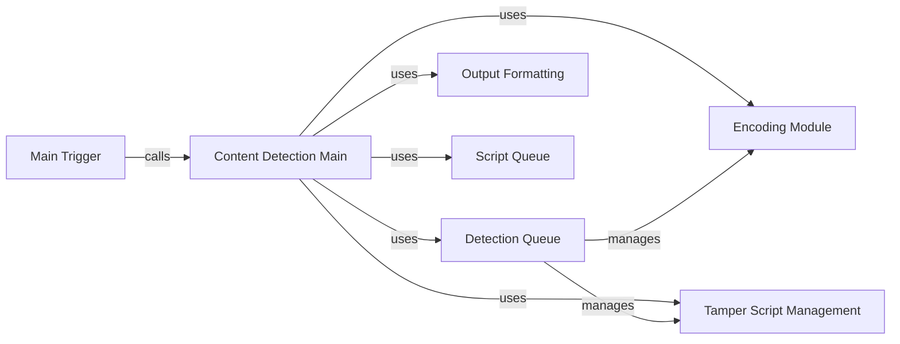

## Component Details

The Core Engine orchestrates the WAF detection process by initializing settings, managing the request/response cycle, and coordinating with other components. It starts with the Main Trigger, which initiates the scan. The Content Detection Main then analyzes responses using a Detection Queue for concurrent processing. Encoding and Tamper Script Management are used to modify requests, while Output Formatting structures the results. Script Queue loads necessary scripts for detection.

### Main Trigger
The main entry point of the WhatWaf tool. It orchestrates the overall process of scanning for web application firewalls, setting up the initial configurations and kicking off the detection process.
- **Related Classes/Methods**: `WhatWaf.trigger.main:main` (61:564)

### Content Detection Main
The core logic for detecting WAFs based on content analysis. It manages the process of sending requests and analyzing responses to identify WAF characteristics, utilizing various techniques to determine the presence of a WAF.
- **Related Classes/Methods**: `WhatWaf.content:detection_main` (395:729)

### Detection Queue
Manages a queue of detection tasks, using threads to improve performance. It handles sending requests and processing responses concurrently, allowing for faster and more efficient WAF detection.
- **Related Classes/Methods**: `WhatWaf.content.DetectionQueue:get_response` (82:142), `WhatWaf.content.DetectionQueue:threader` (144:149), `WhatWaf.content.DetectionQueue:threaded_get_response_helper` (151:190), `WhatWaf.content.DetectionQueue:threaded_get_response` (192:217)

### Encoding Module
Handles encoding of payloads for different request types to bypass WAF filters. It ensures that the payloads are properly formatted and encoded to avoid being blocked by the WAF.
- **Related Classes/Methods**: `WhatWaf.content:encode` (220:225)

### Tamper Script Management
Manages the loading and selection of tamper scripts, which are used to modify requests to evade WAF detection. It provides a mechanism to dynamically alter requests to bypass WAF rules.
- **Related Classes/Methods**: `WhatWaf.content:get_working_tampers` (238:330)

### Output Formatting
Formats the output of the WAF detection process into a dictionary structure for easy consumption and reporting. It structures the results in a standardized format for further analysis and reporting.
- **Related Classes/Methods**: `WhatWaf.content:dictify_output` (364:392)

### Script Queue
Loads and manages scripts used in the detection process. These scripts contain specific payloads or logic for identifying WAFs, providing a flexible way to extend the detection capabilities.
- **Related Classes/Methods**: `WhatWaf.content.ScriptQueue:load_scripts` (38:55)