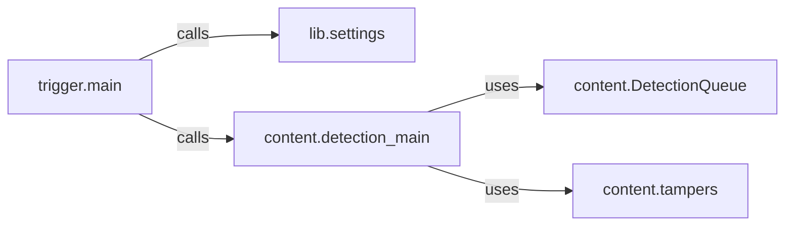

## Component Details

The WhatWaf Core Engine orchestrates the WAF detection process. It begins with `trigger.main`, which initializes settings, tests the target connection, and initiates the core detection logic found in `content.detection_main`. `content.detection_main` utilizes a `DetectionQueue` to manage concurrent HTTP requests and response analysis, employing `content.tampers` to modify payloads for WAF bypass. `lib.settings` provides configuration and utility functions throughout the process, including version checks, result production, and auto-updates. The engine's primary goal is to accurately identify the WAF in use by strategically probing the target and analyzing the responses.

### trigger.main
This function serves as the entry point for the WAF detection process. It orchestrates the entire workflow, including checking the version, testing the target connection, initiating content detection, producing results, and handling auto-updates.
- **Related Classes/Methods**: `WhatWaf.trigger.main:main`

### lib.settings
This module handles various settings and configurations required for the WAF detection process. It includes functions for checking the version, testing the target connection, producing results, auto-updating, and other utility functions.
- **Related Classes/Methods**: `WhatWaf.lib.settings:check_version`, `WhatWaf.lib.settings:test_target_connection`, `WhatWaf.lib.settings:produce_results`, `WhatWaf.lib.settings:auto_update`, `WhatWaf.lib.settings:do_mine_for_whatwaf`

### content.detection_main
This module contains the core logic for detecting WAFs. It involves sending various HTTP requests with different payloads and analyzing the responses to identify WAF signatures.
- **Related Classes/Methods**: `WhatWaf.content:detection_main`

### content.DetectionQueue
This module manages the queue of detection tasks. It handles sending requests, processing responses, and managing threads for concurrent execution.
- **Related Classes/Methods**: `WhatWaf.content.DetectionQueue:get_response`, `WhatWaf.content.DetectionQueue:threader`, `WhatWaf.content.DetectionQueue:threaded_get_response_helper`, `WhatWaf.content.DetectionQueue:threaded_get_response`

### content.tampers
This module contains various payload tampering techniques used to bypass WAFs. It includes functions for adding random comments, unicode characters, and other decoys to the payloads.
- **Related Classes/Methods**: `WhatWaf.content.tampers.randomdecoys:tamper`, `WhatWaf.content.tampers.randomcomments:tamper`, `WhatWaf.content.tampers.randomunicode:tamper`