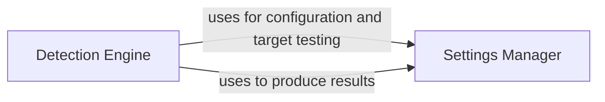

## Component Details

The WhatWaf Core Engine orchestrates the WAF detection process. It initializes settings, configures requests, sends them to the target, and analyzes the responses to identify potential WAFs. The engine manages the application's flow, including target testing and result production, by utilizing components like the Settings Manager and Detection Engine.

### Settings Manager
The Settings Manager is responsible for managing the configuration and settings of the WhatWaf application. It handles tasks such as retrieving page content, configuring request headers, producing results, and testing target connections. It provides a centralized point for managing application settings and configurations.
- **Related Classes/Methods**: ``WhatWaf.lib.settings:get_page` (141:174)`, ``WhatWaf.lib.settings:configure_request_headers` (176:200)`, ``WhatWaf.lib.settings:produce_results` (409:429)`, ``WhatWaf.lib.settings:test_target_connection` (129:139)`

### Detection Engine
The Detection Engine focuses on the core detection logic within WhatWaf. It orchestrates the detection process, analyzing content and identifying potential WAFs. This component likely contains the algorithms and logic used to determine if a WAF is present.
- **Related Classes/Methods**: ``WhatWaf.content:detection_main` (54:63)`