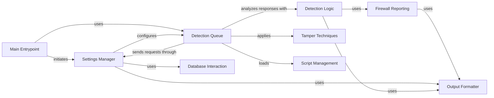

## Component Details

The WhatWaf tool identifies Web Application Firewalls (WAFs) by sending HTTP requests and analyzing the responses. The core engine orchestrates this process, starting from parsing command-line arguments and configuring settings, to dispatching requests with various tampering techniques, and finally analyzing the responses to detect the presence of a WAF. The tool leverages a multi-threaded approach for efficient request handling and uses a database for caching and storing results. The main flow involves initializing settings, creating a queue of requests, applying tampering techniques to bypass WAFs, sending the requests, analyzing the responses, and reporting any identified firewalls.

### Main Entrypoint
The main entry point of the WhatWaf tool. It handles command-line arguments, configures the environment, and initiates the WAF detection process. It also manages the final results and output.
- **Related Classes/Methods**: `WhatWaf.trigger.main`

### Settings Manager
Manages the configuration and settings for the WAF detection process. It handles tasks such as reading settings, configuring request headers, generating random strings, validating URLs, and managing cached URLs.
- **Related Classes/Methods**: `WhatWaf.lib.settings`

### Detection Queue
Handles the queuing and processing of HTTP requests for WAF detection. It manages multiple threads to send requests concurrently and retrieves the responses for analysis.
- **Related Classes/Methods**: `WhatWaf.content.DetectionQueue`

### Detection Logic
The core logic for detecting WAFs based on the responses received. It analyzes the responses and determines if a WAF is present.
- **Related Classes/Methods**: `WhatWaf.content.detection_main`

### Tamper Techniques
Applies various tampering techniques to the payloads to bypass WAFs. It includes different tampering methods such as adding random comments, unicode characters, and decoys.
- **Related Classes/Methods**: `WhatWaf.content.tampers`

### Firewall Reporting
Handles the creation and management of firewall issues that are identified during the WAF detection process.
- **Related Classes/Methods**: `WhatWaf.lib.firewall_found`

### Output Formatter
Provides formatting functions for outputting information, debugging messages, warnings, errors, and other types of messages during the WAF detection process.
- **Related Classes/Methods**: `WhatWaf.lib.formatter`

### Database Interaction
Provides functions for interacting with a database, such as inserting payloads and URLs. It is used for caching results.
- **Related Classes/Methods**: `WhatWaf.lib.database`

### Script Management
Loads and manages scripts used in the WAF detection process. It is used to load WAF detection and tamper scripts.
- **Related Classes/Methods**: `WhatWaf.content.ScriptQueue`
