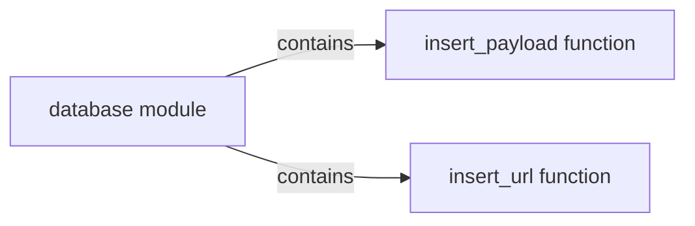

## Component Details

The Data Storage Interface provides a set of functions to interact with the database, abstracting the underlying database operations. It primarily focuses on inserting data related to payloads and URLs, which are crucial for storing information gathered during the scanning process. This interface ensures that the application can store and retrieve data efficiently, facilitating analysis and reporting.

### database module
The database module encapsulates all database interactions, providing a consistent interface for other parts of the application. It handles connection management, query execution, and data sanitization, ensuring data integrity and security. The module abstracts away the specific database implementation, allowing for easier switching or upgrading of the database system in the future.
- **Related Classes/Methods**: ``WhatWaf.lib.database` (0:0)`

### insert_payload function
The insert_payload function is responsible for inserting payload-related data into the database. It receives payload information, such as the payload itself, associated metadata, and scan results, and stores it in the appropriate database table. This function ensures that all relevant information about each payload is persisted for later analysis and reporting.
- **Related Classes/Methods**: ``WhatWaf.lib.database:insert_payload` (20:28)`

### insert_url function
The insert_url function is responsible for inserting URL-related data into the database. It receives URL information, such as the URL itself, associated metadata, and scan results, and stores it in the appropriate database table. This function ensures that all relevant information about each scanned URL is persisted for later analysis and reporting.
- **Related Classes/Methods**: ``WhatWaf.lib.database:insert_url` (30:38)`