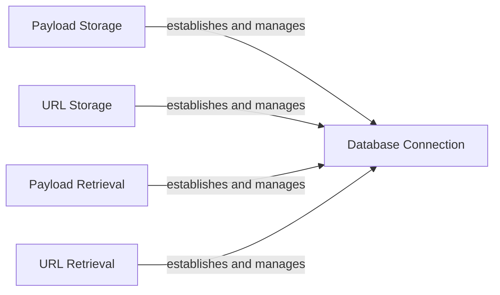

## Component Details

The Data Storage subsystem is responsible for managing the persistence of data related to web application firewall (WAF) detection. It provides functionalities to store and retrieve payloads and URLs, enabling the system to maintain a record of scan data for future analysis and reference. The core of this subsystem revolves around interacting with an SQLite database to store and retrieve information.

### Database Connection
This component manages the connection to the SQLite database. It initializes the database if it doesn't exist and provides a connection object for executing queries. It ensures that all database interactions are performed through a single, consistent connection.
- **Related Classes/Methods**: `WhatWaf.lib.database`

### Payload Storage
This component provides the functionality to insert new payloads into the 'payloads' table in the database. It takes payload-related information as input and stores it in a structured manner, allowing for persistent storage of payloads used in WAF detection.
- **Related Classes/Methods**: `WhatWaf.lib.database:insert_payload`

### URL Storage
This component provides the functionality to insert new URLs into the 'urls' table in the database. It takes URL-related information as input and stores it in a structured manner, enabling the system to keep track of scanned URLs.
- **Related Classes/Methods**: `WhatWaf.lib.database:insert_url`

### Payload Retrieval
This component provides the functionality to retrieve payloads from the 'payloads' table in the database. It allows fetching payloads based on specified criteria or retrieving all payloads, enabling the system to access stored payloads for analysis and comparison.
- **Related Classes/Methods**: `WhatWaf.lib.database:get_payloads`

### URL Retrieval
This component provides the functionality to retrieve URLs from the 'urls' table in the database. It allows fetching URLs based on specified criteria or retrieving all URLs, enabling the system to access stored URLs for analysis and reporting.
- **Related Classes/Methods**: `WhatWaf.lib.database:get_urls`