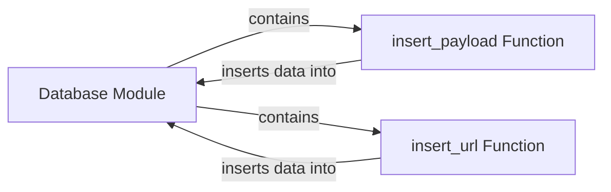

## Component Details

The Data Storage component in WhatWaf is responsible for managing the persistence of scan data, including URLs and payloads. It provides functions to insert new URLs and payloads into the database, allowing the application to track scan progress and maintain a history of previous scans. The database module acts as a central point for all database interactions.

### Database Module
The `database.py` module encapsulates the database interaction logic. It provides functions for inserting, querying, and managing data within the database. It acts as a central point for all database operations within the WhatWaf application.
- **Related Classes/Methods**: `WhatWaf.lib.database`

### insert_payload Function
The `insert_payload` function is responsible for inserting payload data into the database. It takes payload details as input and stores them in a designated table, likely including information such as payload content, type, and associated scan details.
- **Related Classes/Methods**: `WhatWaf.lib.database:insert_payload`

### insert_url Function
The `insert_url` function is responsible for inserting URL data into the database. It takes URL details as input and stores them in a designated table, likely including information such as the URL itself, scan status, and associated scan details.
- **Related Classes/Methods**: `WhatWaf.lib.database:insert_url`