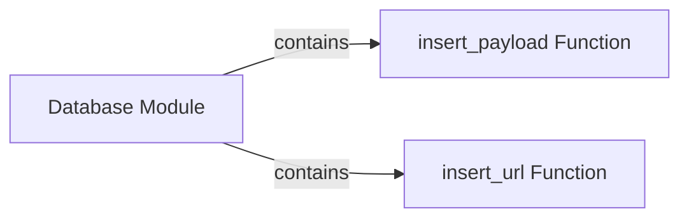

## Component Details

The Data Storage component is responsible for managing the persistence of data related to payloads and URLs within the WhatWaf application. It provides an abstraction layer over database operations, ensuring data integrity and consistency. The component offers functionalities to insert, retrieve, and potentially update data, facilitating other components' access to stored information about web application attacks and vulnerabilities.

### Database Module
The database module encapsulates all database interactions, providing functions to insert, query, and manage data related to payloads and URLs. It abstracts the underlying database implementation, allowing for flexibility and maintainability. This module serves as the central point for all database operations within the application.
- **Related Classes/Methods**: `WhatWaf.lib.database` (full file reference)

### insert_payload Function
This function is responsible for inserting payload-related data into the database. It takes payload information as input, sanitizes it, and stores it in the appropriate database table. It interacts with the database module to perform the insertion operation, ensuring data integrity and consistency.
- **Related Classes/Methods**: `WhatWaf.lib.database:insert_payload` (54:72)

### insert_url Function
This function is responsible for inserting URL-related data into the database. It takes URL information as input, validates it, and stores it in the appropriate database table. It interacts with the database module to perform the insertion operation, ensuring data integrity and consistency.
- **Related Classes/Methods**: `WhatWaf.lib.database:insert_url` (75:124)