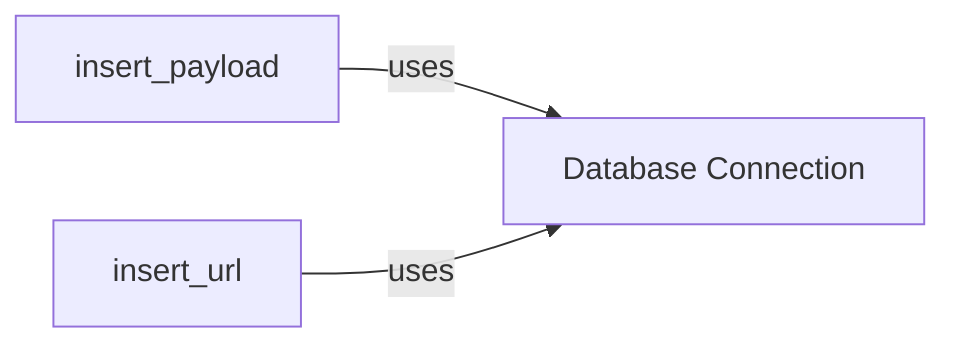

## Component Details

The Data Storage subsystem in WhatWaf is responsible for persisting data related to detected payloads and URLs. It provides functionality to insert payload and URL information into a database, enabling tracking, analysis, and debugging of WAF detection processes. The core components are the functions for inserting data and the underlying database connection management.

### insert_payload
This function inserts payload data into the database. It takes payload-related information as input and stores it in a structured format within the database. This allows for tracking and analysis of potentially malicious payloads detected by WhatWaf.
- **Related Classes/Methods**: `WhatWaf.lib.database:insert_payload`

### insert_url
This function inserts URL data into the database. It takes URL-related information as input and stores it in a structured format within the database. This allows for tracking and analysis of URLs that are part of the WAF detection process.
- **Related Classes/Methods**: `WhatWaf.lib.database:insert_url`

### Database Connection
This component manages the connection to the database. It is responsible for establishing and maintaining the connection, as well as executing queries. It is used by both `insert_payload` and `insert_url` to interact with the database.
- **Related Classes/Methods**: `WhatWaf.lib.database`