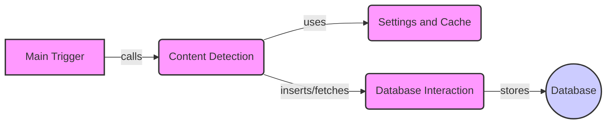

### Component Descriptions:

*   **Main Trigger**: Serves as the application's entry point, initiating the content detection process. It calls the `Content Detection` component to start the workflow.
    *   Relevant source files: `repos.WhatWaf.trigger.main`

*   **Content Detection**: Detects content and inserts URLs into the database. It uses `Settings and Cache` to check URLs and interacts with `Database Interaction` to store the URLs.
    *   Relevant source files: `repos.WhatWaf.content`

*   **Settings and Cache**: Handles application settings and checks URLs against cached data in the database, optimizing performance. It is used by `Content Detection` to validate and cache URLs.
    *   Relevant source files: `repos.WhatWaf.settings`

*   **Database Interaction**: Manages all interactions with the database, including initializing the database, fetching data, and inserting new payloads and URLs. It provides an abstraction layer for database operations and stores data in the `Database`.
    *   Relevant source files: `repos.WhatWaf.lib.database`

*   **Database**: Represents the actual database where payloads and URL information are stored.
