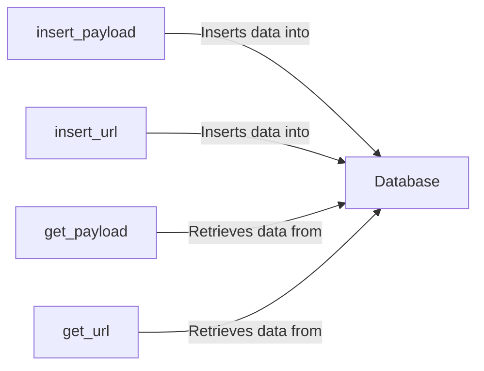

## Component Details

The Data Store component is responsible for managing the persistence of data within the WhatWaf application. It provides an abstraction layer for interacting with the underlying database, allowing the application to store and retrieve payloads, URLs, and scan results. The component ensures data integrity and provides a consistent interface for data access throughout the application's lifecycle. It encapsulates the database connection and provides methods for interacting with the database. It encapsulates the database operations such as executing queries and managing connections.

### Database
The Database class manages the connection to the SQLite database. It provides methods for executing queries, creating tables, and managing the database connection. It acts as a central point for all database interactions, ensuring that the application can reliably store and retrieve data.
- **Related Classes/Methods**: `WhatWaf.lib.database.Database`
- **Source Files**: `WhatWaf/lib/database.py`

### insert_payload
The insert_payload function inserts a new payload into the 'payloads' table in the database. It takes the payload data as input and executes an SQL INSERT statement to add the data to the table. This function is crucial for storing the payloads used during the scanning process.
- **Related Classes/Methods**: `WhatWaf.lib.database.insert_payload`
- **Source Files**: `WhatWaf/lib/database.py`

### insert_url
The insert_url function inserts a new URL into the 'urls' table in the database. It takes the URL data as input and executes an SQL INSERT statement to add the data to the table. This function is essential for tracking the URLs that are being scanned.
- **Related Classes/Methods**: `WhatWaf.lib.database.insert_url`
- **Source Files**: `WhatWaf/lib/database.py`

### get_payload
The get_payload function retrieves a payload from the 'payloads' table based on a given ID. It executes an SQL SELECT statement to fetch the payload data from the table. This function is used to retrieve specific payloads for further processing or analysis.
- **Related Classes/Methods**: `WhatWaf.lib.database.get_payload`
- **Source Files**: `WhatWaf/lib/database.py`

### get_url
The get_url function retrieves a URL from the 'urls' table based on a given ID. It executes an SQL SELECT statement to fetch the URL data from the table. This function is used to retrieve specific URLs for further scanning or analysis.
- **Related Classes/Methods**: `WhatWaf.lib.database.get_url`
- **Source Files**: `WhatWaf/lib/database.py`