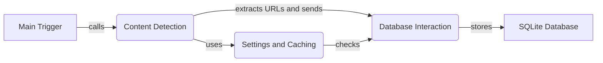

### Component Descriptions:

**1. Main Trigger**
   - *Description*: The main entry point that triggers the WAF analysis workflow. It initializes the database and starts the process of content detection and analysis.
   - *Functionality*: Initializes the database connection and starts the content detection process.
   - *Interaction*: Calls the `Content Detection` component to start the analysis.
   - *Relevant source files*: `repos.WhatWaf.trigger.main`

**2. Content Detection**
   - *Description*: Detects content, extracts URLs, and inserts them into the database for further analysis. This component is responsible for identifying potential targets for WAF detection.
   - *Functionality*: Detects content, extracts URLs, and sends them to the `Database Interaction` component.
   - *Interaction*: Receives calls from `Main Trigger`, uses `Settings and Caching`, and sends data to `Database Interaction`.
   - *Relevant source files*: `repos.WhatWaf.content`

**3. Database Interaction**
   - *Description*: Handles all database operations, including initializing the database connection, inserting payloads and URLs, and fetching data. It provides an abstraction layer for interacting with the database.
   - *Functionality*: Manages database operations such as inserting URLs and payloads, and fetching data.
   - *Interaction*: Receives data from `Content Detection` and interacts with the `SQLite Database`.
   - *Relevant source files*: `repos.WhatWaf.lib.database`

**4. SQLite Database**
   - *Description*: The SQLite database where URLs, payloads, and identified WAFs are stored.
   - *Functionality*: Stores and retrieves data related to payloads, URLs, and identified WAFs.
   - *Interaction*: Interacted with by the `Database Interaction` component.
   - *Relevant source files*: `repos.WhatWaf.lib.database`

**5. Settings and Caching**
   - *Description*: Manages settings and checks URLs against cached data in the database to avoid redundant analysis. This component optimizes performance by reusing previous results.
   - *Functionality*: Checks URLs against cached data in the database.
   - *Interaction*: Used by `Content Detection` to check if a URL has already been analyzed.
   - *Relevant source files*: `repos.WhatWaf.lib.settings`
