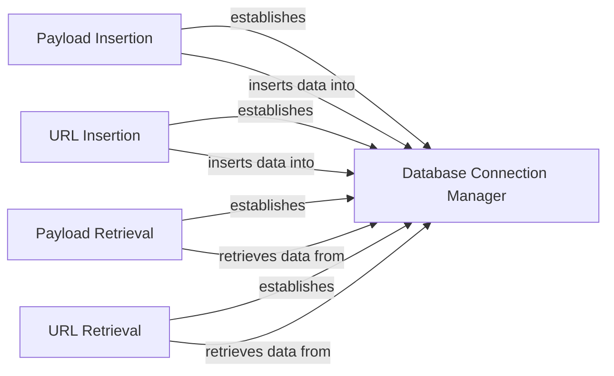

## Component Details

The Database Manager component is responsible for managing the SQLite database used by WhatWaf. It handles establishing a connection to the database, inserting new payloads and URLs, and retrieving payloads and URLs based on specified criteria. This component ensures that the tool has access to the necessary data for scanning and that the data is stored and retrieved efficiently.

### Database Connection Manager
This component is responsible for establishing and managing the connection to the SQLite database. It ensures that a connection is available for performing database operations and handles connection pooling or reconnection logic if needed.
- **Related Classes/Methods**: `WhatWaf.lib.database`

### Payload Insertion
This component provides the functionality to insert payload data into the 'payloads' table in the database. It takes payload-related information as input, sanitizes it, and stores it in a structured format within the database.
- **Related Classes/Methods**: `WhatWaf.lib.database`

### URL Insertion
This component provides the functionality to insert URL data into the 'urls' table in the database. It takes URL-related information as input, validates it, and stores it in a structured format within the database.
- **Related Classes/Methods**: `WhatWaf.lib.database`

### Payload Retrieval
This component provides the functionality to retrieve payloads from the database based on specified criteria. It allows other components to access the stored payloads for scanning purposes, potentially filtering or ordering the results based on the needs of the calling component.
- **Related Classes/Methods**: `WhatWaf.lib.database`

### URL Retrieval
This component provides the functionality to retrieve URLs from the database based on specified criteria. It allows other components to access the stored URLs for scanning purposes, potentially filtering or ordering the results based on the needs of the calling component.
- **Related Classes/Methods**: `WhatWaf.lib.database`
