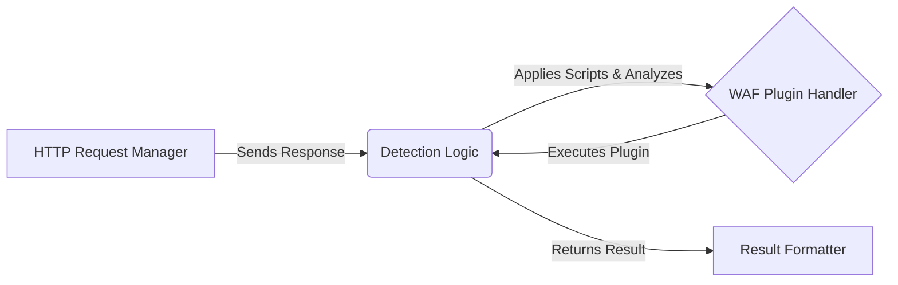

## Detection Logic Overview

The `Detection Logic` component is responsible for the core WAF detection process. It receives HTTP responses from the `HTTP Request Manager`, applies relevant detection scripts, and determines if a WAF is present. This component interacts heavily with the `WAF Plugin Handler` to utilize specific WAF detection logic.

### Component Descriptions:

*   **HTTP Request Manager:** Sends HTTP requests and receives responses. It provides the raw HTTP response data to the `Detection Logic` component for analysis.
    *   **Relevant source files:** `whatwaf.lib.settings`

*   **Detection Logic:** Contains the core logic for detecting WAFs by analyzing HTTP responses and applying detection scripts. It uses the `WAF Plugin Handler` to execute specific WAF detection logic and returns the result to the `Result Formatter`.
    *   **Relevant source files:** `whatwaf.content`

*   **WAF Plugin Handler:** Loads and executes WAF plugins to detect specific WAFs. It receives requests from the `Detection Logic` component and executes the appropriate plugin.
    *   **Relevant source files:** `whatwaf.content.plugins`

*   **Result Formatter:** Formats and logs the results of the WAF detection process. It receives the detection result from the `Detection Logic` component.
    *   **Relevant source files:** `whatwaf.lib.formatter`

