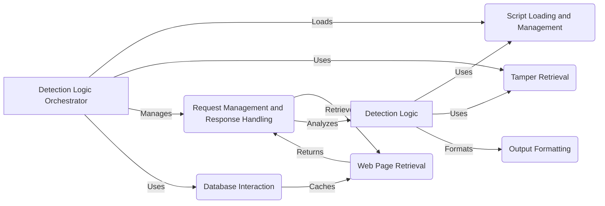

## Detection Logic Overview

This document provides an overview of the `Detection Logic` component within the WhatWaf project. The core responsibility of this component is to detect Web Application Firewalls (WAFs) by utilizing scripts and tampers to analyze HTTP responses. It interacts closely with other components such as `Request Management and Response Handling`, `Script Loading and Management`, and `Tamper Retrieval` to perform its detection tasks.

### Data Flow Diagram

### Component Descriptions

*   **Detection Logic Orchestrator**
    *   Description: The main function that orchestrates the detection process. It sets up the environment, loads necessary components, and handles unhandled exceptions.
    *   Interaction: Loads scripts from `Script Loading and Management`, retrieves tampers from `Tamper Retrieval`, and manages requests via `Request Management and Response Handling`. Interacts with `Database Interaction` for caching.
    *   Relevant source files: `repos.WhatWaf.content:detection_main`

*   **Request Management and Response Handling**
    *   Description: Manages the queue of requests and responses, handling both single-threaded and multi-threaded requests to optimize detection speed.
    *   Interaction: Retrieves web pages using `Web Page Retrieval` and passes responses to `Detection Logic` for analysis. 
    *   Relevant source files: `repos.WhatWaf.content.DetectionQueue`, `repos.WhatWaf.content.DetectionQueue:get_response`, `repos.WhatWaf.content.DetectionQueue:threader`, `repos.WhatWaf.content.DetectionQueue:threaded_get_response_helper`, `repos.WhatWaf.content.DetectionQueue:threaded_get_response`

*   **Script Loading and Management**
    *   Description: Loads and manages scripts used in the detection process, providing a flexible way to define detection rules.
    *   Interaction: Loaded by `Detection Logic Orchestrator` and used by `Detection Logic` to execute detection scripts.
    *   Relevant source files: `repos.WhatWaf.content.ScriptQueue`, `repos.WhatWaf.content.ScriptQueue:load_scripts`

*   **Tamper Retrieval**
    *   Description: Retrieves working tampers for the detection process, enabling the system to bypass potential WAF protections.
    *   Interaction: Retrieved by `Detection Logic Orchestrator` and used by `Detection Logic` to modify requests.
    *   Relevant source files: `repos.WhatWaf.content:get_working_tampers`

*   **Web Page Retrieval**
    *   Description: Retrieves web pages, handling proxies, agents, and other request parameters to simulate real-world traffic.
    *   Interaction: Used by `Request Management and Response Handling` to fetch web pages. Caches responses using `Database Interaction`.
    *   Relevant source files: `lib.settings:get_page`

*   **Detection Logic**
    *   Description: Core component responsible for detecting WAFs by utilizing scripts and tampers to analyze HTTP responses.
    *   Interaction: Uses scripts from `Script Loading and Management` and tampers from `Tamper Retrieval` to analyze responses received from `Request Management and Response Handling`. Formats output using `Output Formatting`.
    *   Relevant source files: `repos.WhatWaf.content:detection_main`

*   **Output Formatting**
    *   Description: Provides functions for formatting output, including different message types (info, warn, success, etc.) to improve user experience.
    *   Interaction: Used by `Detection Logic` to format detection results.
    *   Relevant source files: `lib.formatter.info`, `lib.formatter.warn`, `lib.formatter.success`, `lib.formatter.prompt`, `lib.formatter.debug`, `lib.formatter.error`, `lib.formatter.payload`, `lib.formatter.discover`

*   **Database Interaction**
    *   Description: Handles database interactions for caching payloads and URLs, improving performance and reducing redundant requests. Includes functions for initializing the database, fetching data, and inserting new records.
    *   Interaction: Used by `Detection Logic Orchestrator` and `Web Page Retrieval` for caching and retrieving data.
    *   Relevant source files: `lib.settings:initialize`, `lib.settings:fetch_data`, `lib.settings:insert_payload`, `lib.settings:insert_url`