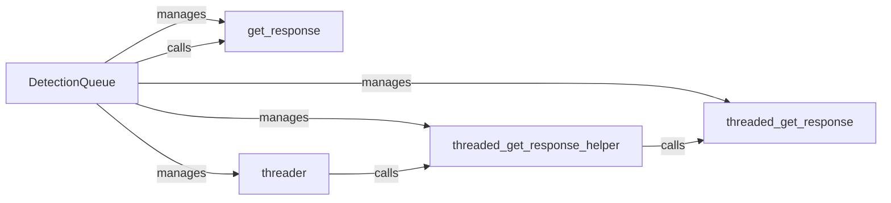

## Component Details

The Detection Management component orchestrates the process of sending HTTP requests to a target server and analyzing the responses to identify potential Web Application Firewall (WAF) solutions. It leverages threading to concurrently send multiple requests, improving efficiency. The core of this component lies in the `DetectionQueue` class, which manages the queue of requests, spawns threads via the `threader` method, and uses helper functions to retrieve responses within each thread. The component ensures that the detection process is robust and can handle a variety of network conditions and server responses.

### DetectionQueue
The DetectionQueue class manages a queue of requests to be sent to a web server and processes the responses to detect potential web application firewall (WAF) solutions. It uses threading to send requests concurrently and improve performance.
- **Related Classes/Methods**: ``WhatWaf.content.DetectionQueue` (0:0)`, ``WhatWaf.content.DetectionQueue:get_response` (21:30)`, ``WhatWaf.content.DetectionQueue:threader` (32:41)`, ``WhatWaf.content.DetectionQueue:threaded_get_response_helper` (43:52)`, ``WhatWaf.content.DetectionQueue:threaded_get_response` (54:63)`

### get_response
The `get_response` method is responsible for retrieving HTTP responses from the target server. It likely handles the core logic of sending requests and receiving responses, potentially including error handling and retry mechanisms.
- **Related Classes/Methods**: ``WhatWaf.content.DetectionQueue:get_response` (21:30)`

### threader
The `threader` method is responsible for managing and coordinating the threads used to send requests concurrently. It likely creates and starts the threads, and ensures that they are properly synchronized and managed.
- **Related Classes/Methods**: ``WhatWaf.content.DetectionQueue:threader` (32:41)`

### threaded_get_response_helper
The `threaded_get_response_helper` method likely contains the logic executed by each thread. It calls `threaded_get_response` and processes the result.
- **Related Classes/Methods**: ``WhatWaf.content.DetectionQueue:threaded_get_response_helper` (43:52)`

### threaded_get_response
The `threaded_get_response` method is the actual method that sends the HTTP request and retrieves the response within a thread. It likely uses a library like `requests` to perform the HTTP communication.
- **Related Classes/Methods**: ``WhatWaf.content.DetectionQueue:threaded_get_response` (54:63)`