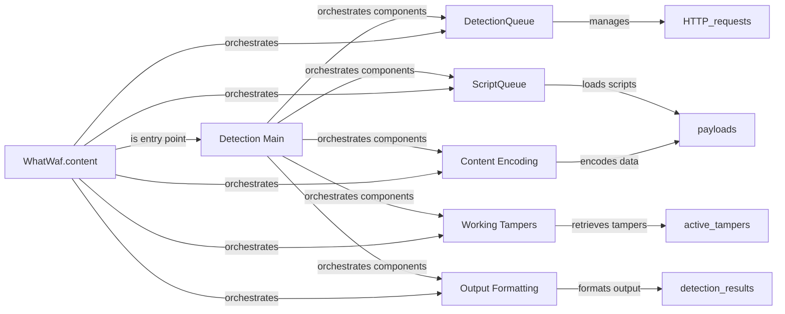

## Component Details

The detection workflow orchestrates the process of identifying web application firewall (WAF) presence and characteristics. It begins by loading scripts containing payloads and configurations. These scripts are managed by the ScriptQueue. The core of the workflow involves sending HTTP requests with potentially tampered payloads, managed by the DetectionQueue. The Working Tampers component provides a list of active tampers that modify payloads to bypass security filters. The Content Encoding component ensures proper formatting of the payloads. The responses are then processed, and the output is formatted into a dictionary by the Output Formatting component. The Detection Main component serves as the central orchestrator, coordinating the activities of the other components. The WhatWaf.content class encapsulates the entire workflow, providing the entry point and managing the interactions between the components.

### DetectionQueue
The DetectionQueue class manages the queueing and execution of HTTP requests, potentially using threads for concurrent execution. It handles retrieving responses and managing the overall flow of requests and responses during the detection process.
- **Related Classes/Methods**: `WhatWaf.content.DetectionQueue:get_response` (82:142), `WhatWaf.content.DetectionQueue:threader` (144:149), `WhatWaf.content.DetectionQueue:threaded_get_response_helper` (151:190), `WhatWaf.content.DetectionQueue:threaded_get_response` (192:217), `WhatWaf.content.DetectionQueue` (58:217)

### ScriptQueue
The ScriptQueue class is responsible for loading and managing scripts, which likely contain payloads or other data used in the detection process. It initializes and provides access to the scripts that will be used during the detection phase.
- **Related Classes/Methods**: `WhatWaf.content.ScriptQueue:load_scripts` (38:55), `WhatWaf.content.ScriptQueue` (23:55)

### Content Encoding
The `encode` function is responsible for encoding data, likely payloads, before sending them in requests. This ensures that the data is properly formatted and transmitted to the target web application.
- **Related Classes/Methods**: `WhatWaf.content:encode` (220:225)

### Working Tampers
The `get_working_tampers` function retrieves a list of active tampers. Tampers are functions that modify the payload to bypass security filters. This function provides the list of tampers that will be applied during the detection process.
- **Related Classes/Methods**: `WhatWaf.content:get_working_tampers` (238:330)

### Output Formatting
The `dictify_output` function formats the output of the detection process into a dictionary. This allows for easy access and manipulation of the results, providing a structured representation of the detection findings.
- **Related Classes/Methods**: `WhatWaf.content:dictify_output` (364:392)

### Detection Main
The `detection_main` function is the main entry point for the detection process. It orchestrates the different components, including loading scripts, managing the detection queue, retrieving responses, and applying tampers, to execute the overall detection workflow.
- **Related Classes/Methods**: `WhatWaf.content:detection_main` (395:729)

### WhatWaf.content
This class seems to be the main class that orchestrates the detection workflow. It uses the other components to load scripts, manage the detection queue, retrieve responses, process content, and utilize tampering modules. It is the central control point for the WAF detection process.
- **Related Classes/Methods**: `WhatWaf.content` (19:730)