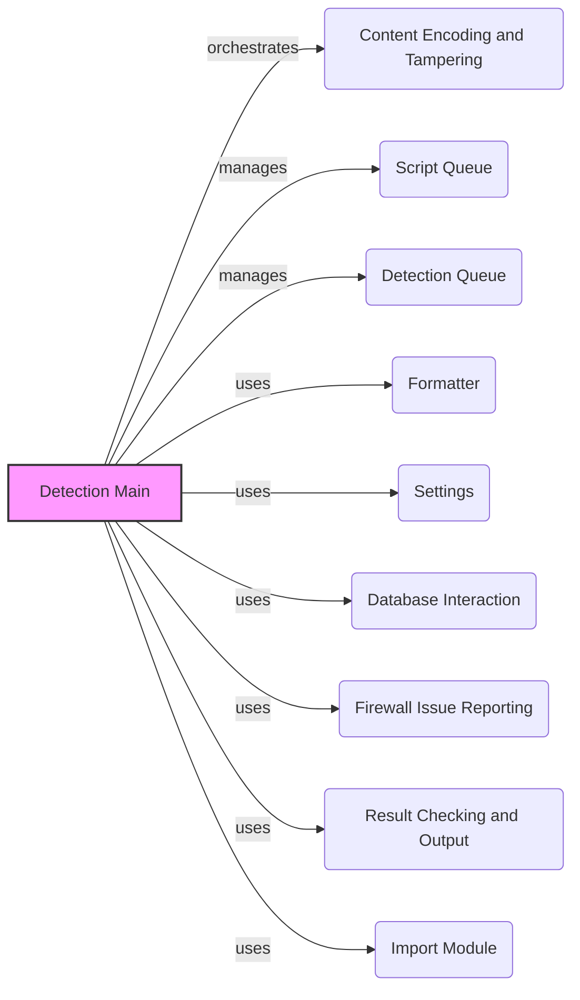

## Component Descriptions:

**Detection Main**
*Description*: Orchestrates the entire detection process. It sends requests, analyzes responses, and reports findings, acting as the central control point.
*Interactions*: Manages `Content Encoding and Tampering`, `Script Queue`, and `Detection Queue`. Uses `Formatter`, `Settings`, `Database Interaction`, `Firewall Issue Reporting`, `Result Checking and Output`, and `Import Module` to perform its functions.
*Source Files*: `repos.WhatWaf.content:detection_main`

**Content Encoding and Tampering**
*Description*: Handles encoding of payloads and retrieval of working tamper scripts. Responsible for modifying the request to bypass WAF rules.
*Interactions*: Receives instructions from `Detection Main` to encode payloads. Provides encoded payloads to `Detection Queue`.
*Source Files*: `repos.WhatWaf.content:encode`, `repos.WhatWaf.content:get_working_tampers`

**Script Queue**
*Description*: Manages the tamper scripts used in the detection process. It loads, organizes, and provides access to these scripts for request modification.
*Interactions*: Provides tamper scripts to `Content Encoding and Tampering` upon request from `Detection Main`.
*Source Files*: `repos.WhatWaf.content.ScriptQueue`, `repos.WhatWaf.content.ScriptQueue:load_scripts`

**Detection Queue**
*Description*: Handles the queuing and execution of detection requests. It manages threads for concurrent requests and retrieves responses, optimizing the detection speed.
*Interactions*: Receives encoded payloads from `Content Encoding and Tampering`. Sends requests and receives responses. Passes responses to `Result Checking and Output`.
*Source Files*: `repos.WhatWaf.content.DetectionQueue`, `repos.WhatWaf.content.DetectionQueue:get_response`, `repos.WhatWaf.content.DetectionQueue:threader`, `repos.WhatWaf.content.DetectionQueue:threaded_get_response`, `repos.WhatWaf.content.DetectionQueue:threaded_get_response_helper`

**Formatter**
*Description*: Provides formatting functions for logging and displaying information. It ensures consistent and readable output for different message types (info, warning, error, etc.).
*Interactions*: Used by `Detection Main` and other components for logging and output.
*Source Files*: `lib.formatter.info`, `lib.formatter.warn`, `lib.formatter.debug`, `lib.formatter.payload`, `lib.formatter.error`, `lib.formatter.success`, `lib.formatter.prompt`, `lib.formatter.discover`

**Settings**
*Description*: Provides functions for managing settings, creating fingerprints, and generating random strings. It configures the detection process and generates unique identifiers.
*Interactions*: Used by `Detection Main` to configure the detection process.
*Source Files*: `lib.settings.get_page`, `lib.settings.create_fingerprint`, `lib.settings.random_string`, `lib.settings.generate_random_post_string`, `lib.settings.validate_url`, `lib.settings.produce_results`, `lib.settings.write_to_file`, `lib.settings.shuffle_list`

**Database Interaction**
*Description*: Handles inserting URLs and detected protections into the database. It stores the results of the detection process for later analysis.
*Interactions*: Used by `Detection Main` to store detection results.
*Source Files*: `lib.database.insert_url`

**Firewall Issue Reporting**
*Description*: Reports detected firewall issues. It facilitates the reporting of identified vulnerabilities or misconfigurations.
*Interactions*: Used by `Detection Main` to report detected firewall issues.
*Source Files*: `lib.firewall_found.request_firewall_issue_creation`

**Result Checking and Output**
*Description*: Checks if a match is found in the response and formats the output into a dictionary. It determines whether a WAF is present and structures the findings.
*Interactions*: Receives responses from `Detection Queue`. Sends results to `Detection Main`.
*Source Files*: `repos.WhatWaf.content:check_if_matched`, `repos.WhatWaf.content:dictify_output`

**Import Module**
*Description*: Dynamically imports modules. It allows the system to load and use external modules at runtime.
*Interactions*: Used by `Detection Main` to import necessary modules.
*Source Files*: `importlib.import_module`