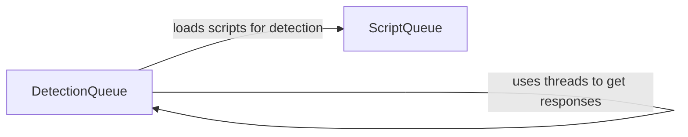

## Component Details

The Detection and Response Analysis component is responsible for managing the process of detecting web application firewalls (WAFs). It involves loading detection scripts, sending HTTP requests based on these scripts, receiving and analyzing the responses, and using the analysis to identify the presence and characteristics of WAFs. The component utilizes threading to improve efficiency when handling multiple requests concurrently. It interacts with other components such as Payload Injection and Tampering to send requests and WAF Identification and Reporting to report findings.

### ScriptQueue
The ScriptQueue component is responsible for loading and managing detection scripts from a specified directory. These scripts define the payloads and techniques used to probe for WAFs.
- **Related Classes/Methods**: `WhatWaf.content.ScriptQueue:load_scripts` (38:55)

### DetectionQueue
The DetectionQueue component manages the execution of detection scripts. It handles sending requests, receiving responses, and analyzing the responses to identify WAFs. It uses threading to improve performance when sending multiple requests.
- **Related Classes/Methods**: `WhatWaf.content.DetectionQueue` (58:217), `WhatWaf.content.DetectionQueue:get_response` (82:142), `WhatWaf.content.DetectionQueue:threader` (144:149), `WhatWaf.content.DetectionQueue:threaded_get_response_helper` (151:190), `WhatWaf.content.DetectionQueue:threaded_get_response` (192:217)