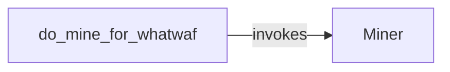

## Component Details

The External Miner Integration component focuses on integrating external mining tools into the WhatWaf application to enhance its detection capabilities. It involves installing, configuring, and executing the miner module. The process is initiated by the `do_mine_for_whatwaf` function, which then utilizes the `Miner` class to handle the actual mining operations. The `Miner` class is responsible for installing the necessary mining components and running the main mining logic.

### Miner
The Miner class is responsible for installing and running mining components for WhatWaf. It initializes the mining environment, installs necessary dependencies, and executes the main mining logic. It interacts with the system to install dependencies and execute mining commands.
- **Related Classes/Methods**: `WhatWaf.lib.miner.Miner` (28:147), `WhatWaf.lib.miner.Miner:__do_miner_install` (55:78), `WhatWaf.lib.miner.Miner:init` (80:95), `WhatWaf.lib.miner.Miner:main` (111:147)

### do_mine_for_whatwaf
This function serves as the entry point for initiating the mining process within WhatWaf. It orchestrates the initialization and execution of the Miner class. It is called to start the mining process and interacts with the Miner class to perform the mining operations.
- **Related Classes/Methods**: `WhatWaf.lib.settings:do_mine_for_whatwaf` (965:970)