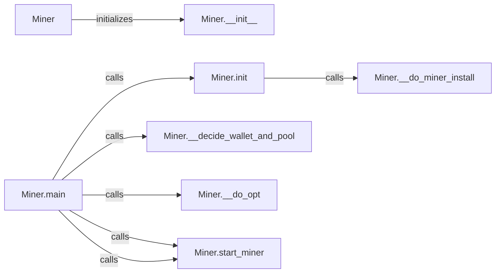

## Component Details

The External Tool Integration component focuses on integrating external tools, specifically an XMR CPU miner, into the WhatWaf framework. It manages the installation, configuration, and execution of the miner based on user preferences. The component initializes the miner, handles user opt-in, selects wallets and pools, and starts the miner in a separate thread. It also manages configuration files and interacts with the file system for installation and execution.

### Miner
The Miner class is the central component responsible for managing the XMR CPU miner. It encapsulates the logic for installing, configuring, and running the miner based on user opt-in preferences. It interacts with the file system for configuration and installation, and uses subprocess for running the miner.
- **Related Classes/Methods**: ``WhatWaf.lib.miner.Miner` (0:0)`

### Miner.__init__
Initializes the Miner object with paths to miner files, wallets, and pools. It takes an 'opted' parameter to determine the user's opt-in preference, setting up the initial state of the miner.
- **Related Classes/Methods**: ``WhatWaf.lib.miner.Miner:__init__` (24:39)`

### Miner.__do_miner_install
Installs the XMR CPU miner by writing and executing an installation script. It also creates necessary directories and moves the miner script to the correct location. It checks for a lock file to prevent multiple installations, ensuring that the installation process is only executed once.
- **Related Classes/Methods**: ``WhatWaf.lib.miner.Miner:__do_miner_install` (41:50)`

### Miner.init
Initializes the miner configuration. If the miner home directory doesn't exist, it creates it, installs the miner using `__do_miner_install`, and prompts the user for their XMR wallet address. It then saves the configuration to a JSON file, persisting the miner's settings.
- **Related Classes/Methods**: ``WhatWaf.lib.miner.Miner:init` (0:0)`

### Miner.main
The main function of the Miner class. It checks if the user has opted in to mining, and if so, it initializes the miner using `init`, selects a wallet and pool using `__decide_wallet_and_pool`, and starts the miner in a separate thread using `start_miner`. It also handles errors and platform-specific issues, orchestrating the miner's operation.
- **Related Classes/Methods**: ``WhatWaf.lib.miner.Miner:main` (52:55)`

### Miner.__decide_wallet_and_pool
Randomly selects a wallet and pool from the available options, providing a degree of decentralization and flexibility in the mining operation.
- **Related Classes/Methods**: ``WhatWaf.lib.miner.Miner:__decide_wallet_and_pool` (0:0)`

### Miner.__do_opt
Updates the opt-in status in the miner configuration file, allowing the user to enable or disable mining.
- **Related Classes/Methods**: ``WhatWaf.lib.miner.Miner:__do_opt` (0:0)`

### Miner.start_miner
Starts the XMRig miner process using subprocess.Popen with the specified wallet and pool, initiating the actual mining operation.
- **Related Classes/Methods**: ``WhatWaf.lib.miner.Miner:start_miner` (0:0)`