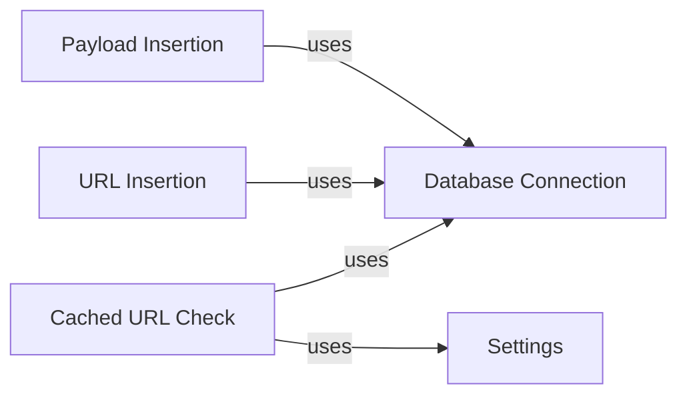

## Component Details

The Fingerprint Database component in WhatWaf is responsible for storing and managing WAF fingerprint data, enabling the application to identify and detect various WAF solutions. It provides functionalities for inserting new payloads and URLs into the database, as well as checking URLs against cached results to optimize performance. The component interacts closely with the Settings component for configuration and the Miner component for updating the database with new fingerprint data.

### Database Connection
Manages the connection to the SQLite database. It provides methods for executing SQL queries, committing changes, and closing the connection. All database interactions are mediated through this component, ensuring proper database access and resource management.
- **Source Reference**: `WhatWaf.lib.database:DatabaseConnection`
  - *File*: `WhatWaf/lib/database.py`

### Payload Insertion
Provides functionality to insert new payloads into the 'payloads' table within the database. This allows the system to expand its fingerprint database with new signatures for WAF detection. It uses the Database Connection component to execute the necessary SQL INSERT statements.
- **Source Reference**: `WhatWaf.lib.database:insert_payload`
  - *File*: `WhatWaf/lib/database.py`

### URL Insertion
Enables the insertion of new URLs into the 'urls' table in the database. This is useful for tracking and analyzing specific URLs that are associated with WAF activity. It relies on the Database Connection component to perform the SQL INSERT operation.
- **Source Reference**: `WhatWaf.lib.database:insert_url`
  - *File*: `WhatWaf/lib/database.py`

### Cached URL Check
Checks if a given URL is already present in the 'urls' table in the database. This allows the system to avoid redundant analysis of previously scanned URLs, improving efficiency. It uses the Database Connection component to query the database and the Settings component to retrieve configuration parameters.
- **Source Reference**: `WhatWaf.lib.settings:check_url_against_cached`
  - *File*: `WhatWaf/lib/settings.py`

### Settings
The Settings component manages the configuration and settings of the WhatWaf application. It provides methods for accessing and modifying settings, including database-related settings such as cache settings.
- **Source Reference**: `WhatWaf.lib.settings:Settings`
  - *File*: `WhatWaf/lib/settings.py`