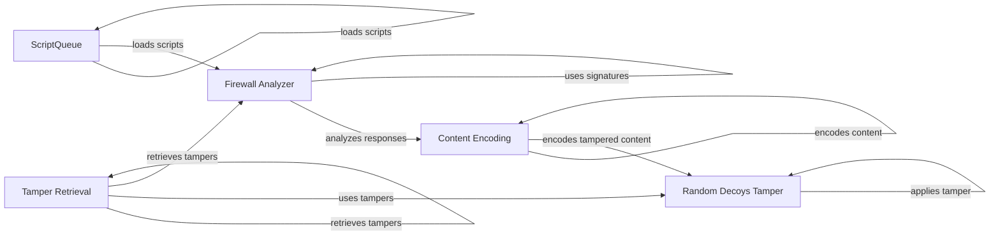

## Component Details

The WhatWaf system analyzes HTTP responses to detect the presence and type of Web Application Firewalls (WAFs). It achieves this by loading and executing scripts, applying content tampering techniques to HTTP requests, and then analyzing the responses using a database of known WAF signatures. The system identifies firewalls based on response patterns and generates issue reports when a firewall is detected.

### Firewall Analyzer
The Firewall Analyzer is responsible for analyzing HTTP responses to detect the presence and type of WAFs. It uses a database of known WAF signatures and applies various detection techniques to identify firewalls based on response patterns. It also generates issue reports when a firewall is detected.
- **Related Classes/Methods**: `WhatWaf.lib.firewall_found` (full file reference)

### ScriptQueue
The ScriptQueue manages the loading and execution of scripts. It is responsible for loading scripts from a specified directory and organizing them for later use. These scripts likely contain the logic for identifying different WAFs.
- **Related Classes/Methods**: `WhatWaf.content.ScriptQueue:load_scripts` (38:55)

### Content Encoding
The Content Encoding component is responsible for encoding the content. It likely handles character encoding and other transformations to ensure data is properly formatted for transmission or storage. This ensures that the tampered content is properly formatted before being sent in the HTTP request.
- **Related Classes/Methods**: `WhatWaf.content:encode` (220:225)

### Tamper Retrieval
The Tamper Retrieval component retrieves a list of active tamper functions. These tampers are used to modify the content to bypass security filters or achieve other desired effects. It acts as a central point for accessing available tampering techniques.
- **Related Classes/Methods**: `WhatWaf.content:get_working_tampers` (238:330)

### Random Decoys Tamper
The Random Decoys Tamper component adds random decoy elements to the content. This is a form of obfuscation to make it harder for security systems to identify malicious patterns. It's one of the specific tampering techniques used.
- **Related Classes/Methods**: `WhatWaf.content.tampers.randomdecoys:tamper` (9:39)