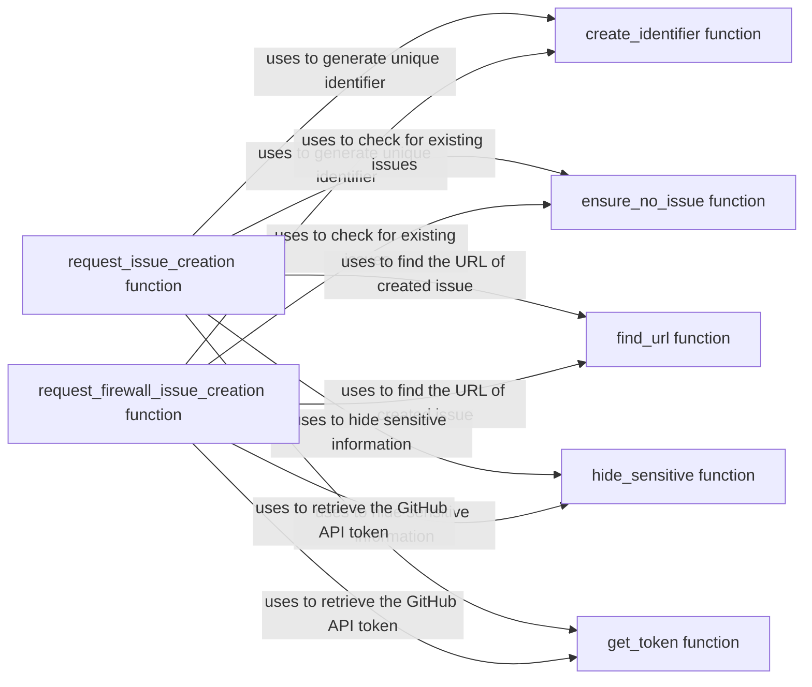

## Component Details

The Firewall Analyzer component detects firewalls by analyzing HTTP responses and generates reports. It includes functionalities for creating GitHub issues for unhandled exceptions or unknown firewalls, ensuring no duplicate issue reports are created, finding existing issue URLs, sanitizing sensitive information, and retrieving the GitHub API token. The component uses a unique identifier to track and prevent duplicate issue reports.

### create_identifier function
This function generates a unique SHA1 hash for a given input, typically firewall fingerprints. This identifier is used to track and prevent duplicate issue reports on GitHub.
- **Related Classes/Methods**: `WhatWaf.lib.firewall_found.create_identifier` (18:24)

### request_issue_creation function
This function handles the process of creating a GitHub issue when an unhandled exception occurs. It gathers relevant information about the error, prompts the user for confirmation, and submits the issue to the WhatWaf GitHub repository.
- **Related Classes/Methods**: `WhatWaf.lib.firewall_found.request_issue_creation` (101:164)

### request_firewall_issue_creation function
This function is responsible for creating a GitHub issue when an unknown firewall is detected. It reads the firewall's fingerprint, prompts the user, and submits the issue to the WhatWaf GitHub repository.
- **Related Classes/Methods**: `WhatWaf.lib.firewall_found.request_firewall_issue_creation` (167:235)

### ensure_no_issue function
This function checks if a GitHub issue with a specific identifier already exists in the WhatWaf repository (both open and closed). It prevents the creation of duplicate issue reports.
- **Related Classes/Methods**: `WhatWaf.lib.firewall_found.ensure_no_issue` (39:57)

### find_url function
This function searches the WhatWaf GitHub issues page for an issue with a given identifier and returns the URL of the issue if found.
- **Related Classes/Methods**: `WhatWaf.lib.firewall_found.find_url` (60:84)

### hide_sensitive function
This function sanitizes command-line arguments by replacing sensitive information (e.g., URLs) with asterisks. This prevents sensitive data from being included in the issue body.
- **Related Classes/Methods**: `WhatWaf.lib.firewall_found.hide_sensitive` (87:98)

### get_token function
This function retrieves the GitHub API token from a file. The token is used to authenticate requests to the GitHub API when creating issues.
- **Related Classes/Methods**: `WhatWaf.lib.firewall_found.get_token` (27:36)